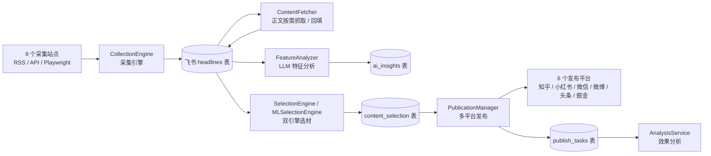

# 01 项目概览

## 1. 一句话定位

apiserver 是一条**内容运营自动化管道**：定时从 9 个新闻/社媒站点采集热点 → 归一化写入飞书多维表格（`headlines` 表）→ 按需抓取正文并用 LLM 做特征分析 → 规则/ML 双引擎选材 → 分发到知乎、小红书、微信公众号等 6 个平台发布 → 回收发布效果数据做分析。

项目内自述为「智能体工作流API服务」（见 `app/main.py` 标题），但**生产环境的实际执行路径是 cron 批任务**，FastAPI HTTP 服务是仓库内提供的另一种运行形态。



## 2. 技术栈

| 层 | 技术 | 版本（requirements.txt pin） | 用途 |
|---|---|---|---|
| Web 框架 | FastAPI + Starlette + Uvicorn | 0.141.1 / 1.6.0 / 0.52.4 | HTTP 服务形态（`app/main.py`） |
| 异步任务 | Celery + Redis + Flower | 5.6.3 / 8.1.0 / 2.1.0 | 容器化形态的异步任务队列（3 条队列） |
| HTTP 客户端 | aiohttp / httpx / requests | 3.14.3 / 0.28.1 / 2.31.0 | 站点采集、飞书 API、平台发布 |
| 浏览器自动化 | Playwright | 1.62.0 | weibo 等 JS 渲染页面（需 `playwright install chromium`） |
| 数据处理 | pandas / numpy / scikit-learn / jieba | 3.0.5 / 2.4.6 / 1.9.1 / 0.42.1 | ML 选材引擎、训练脚本 |
| LLM 生态 | OpenAI 兼容客户端（自研封装） | — | 特征分析 / insights 生成 |
| 飞书 SDK | lark-oapi | 1.7.3 | 飞书开放平台 API |
| 认证加密 | PyJWT / python-jose / cryptography / pycryptodome | 2.14.0 / 3.5.0 / 50.0.1 / 3.23.0 | JWT、Fernet 加密、请求签名 |
| 配置 | pydantic-settings + PyYAML | 2.15.0 / 6.0.3 | `.env` + 4 个 yaml 配置文件 |
| 可观测 | loguru / psutil / prometheus_client | 0.7.3 / 7.2.2 / 0.26.0 | 日志、系统/应用/任务指标 |
| HTML 解析 | beautifulsoup4 / lxml | 4.15.0 / 6.1.3 | 正文提取（另有 stdlib HTMLParser 实现） |

> 依赖锁定原则：`requirements.txt` 是「生产 pip freeze 去噪超集」（92 条），由 `tests/test_requirements_coverage.py` 用全仓 AST import 扫描守护 **0 漏配**。详见文件头部注释。

## 3. 目录结构

```
apiserver/
├── app/                        # 应用主体
│   ├── main.py                 # FastAPI 入口（常驻服务形态）
│   ├── api/v1/                 # 路由层：api.py 注册中心 + endpoints/ 10 个端点模块
│   ├── core/                   # config.py（Settings/ConfigManager）、celery_config.py
│   ├── middleware/             # 限流 / 异常 / 请求日志 / 安全头（4 注册 + 2 未注册）
│   ├── services/               # 业务核心
│   │   ├── collection/         #   采集：engine + sites/9站点 + 守卫 + 正文 + cookie
│   │   ├── feishu/             #   飞书：feishu_service + field_rules + limits + function/
│   │   ├── selection/          #   选材：engine（规则）+ ml_engine（ML）
│   │   ├── publication/        #   发布：manager + platforms/6平台
│   │   └── analysis/           #   分析：feature_analysis/ + insights + classification + storage
│   ├── tasks/                  # Celery 任务：base + collection/selection/publication_tasks
│   ├── utils/                  # crypto / feishu_format / metrics / logger / hotspot_enrich 等
│   └── wework/                 # 企业微信通知与文件推送
├── script/                     # 生产入口与运维脚本（cron 调用的都在这里）
├── tests/                      # 22 个独立测试脚本（python tests/<name>.py 直接运行）
├── config/                     # sites/platforms/analysis/redis.conf（跟踪）
│                               # + credentials/zhihu/xiaohongshu yaml（gitignore，只有 *.example）
├── doc/                        # 设计文档与运维文档（本 Wiki 在 doc/code-wiki/）
├── secret/                     # JWT 令牌生成脚本与本地令牌文件（不入 git）
├── debug/                      # 人工调试脚本（debug_zhihu / debug_auth 等）
├── tmp/                        # 变异测试与临时产物（非运行代码，可忽略）
├── Dockerfile / docker-compose.yml / deploy.sh   # 容器化形态
├── requirements.txt            # 依赖锁定（92 条）
├── run_tests.py                # 测试辅助入口
├── train_content_matching_model.py               # ML 选材模型训练脚本（根目录，未部署生产）
└── parse_xiaohongshu_mcp.py                     # 小红书 MCP 输出解析工具
```

## 4. 术语表

| 术语 | 含义 | 权威出处 |
|---|---|---|
| **站点（site）** | 一个热点采集源，`site_code` 唯一标识（如 `thepaper`） | `config/sites.yaml` 的 `sites.enabled` 名单 |
| **单轮产出上界（cap）** | 站点 `collect()` 对外返回的**最终**条数上界；只登记【终】字面量，预筛/阈值/分页不得登记 | `app/services/collection/site_caps.py` `SITE_ROUND_CAPS` |
| **写入面** | 能把记录写进飞书 `headlines` 表的三个代码路径（pipeline / enhanced 端点 / feishu sync 端点） | README §九-1 |
| **mock 治理** | 站点失败回退 mock 数据必须显式 opt-in（`APISERVER_ALLOW_MOCK=1`），且产出行带 `is_mock` 标记，写入前剔除 | `app/services/collection/mock_utils.py` |
| **容量水位（WATERMARK）** | 17,000 条；写前预检把表压到此线以下 | `app/services/feishu/limits.py` |
| **G1/G2 守卫** | import 期硬断言：G1=单轮Σ上界(460)≤WATERMARK；G2=最坏日上界棘轮冻结在 920 | `site_caps.py:105` |
| **upsert（按 title）** | 采集写入只与**当天**已有记录按 `title` 比对去重，跨天重复是设计语义 | `script/collection_pipeline.py` |
| **authkey / access token** | 两套并存令牌：长效 authkey（365 天，本地脚本生成）与短效 access token（120 分钟，`/auth` 端点签发） | `secret/generate_auth_key.py` / `auth.py` |
| **形态** | 同一份代码的三种运行方式：cron 批任务（生产实际）/ FastAPI 常驻 / Docker 容器 | [02 整体架构](02-整体架构.md) §5 |

## 5. 相关阅读

- 整体架构与容量模型：[02-整体架构](02-整体架构.md)
- 仓库顶层 README（`/README.md`）：系统现状的权威描述，含 HTTP 接口表与已知问题清单
- 设计文档索引：`/README.md` §十（`doc/` 下 20+ 篇设计/运维文档）
