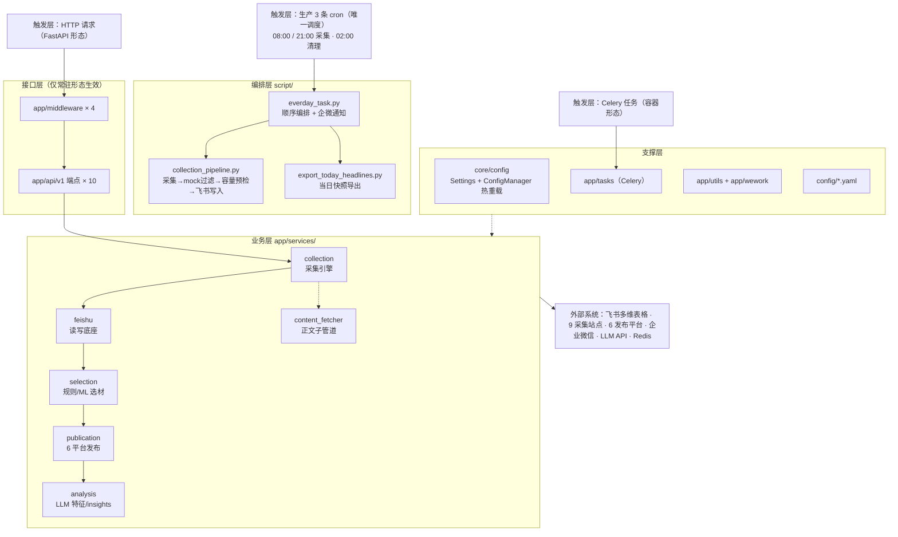
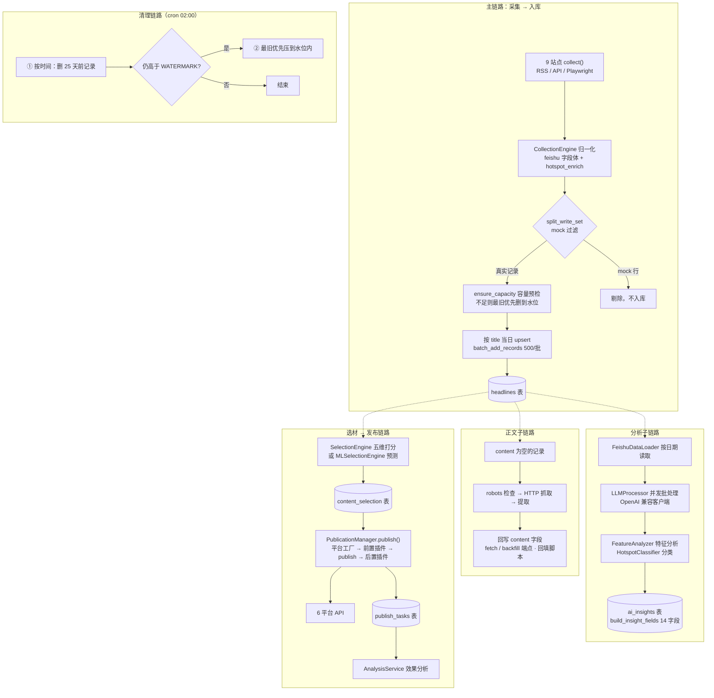
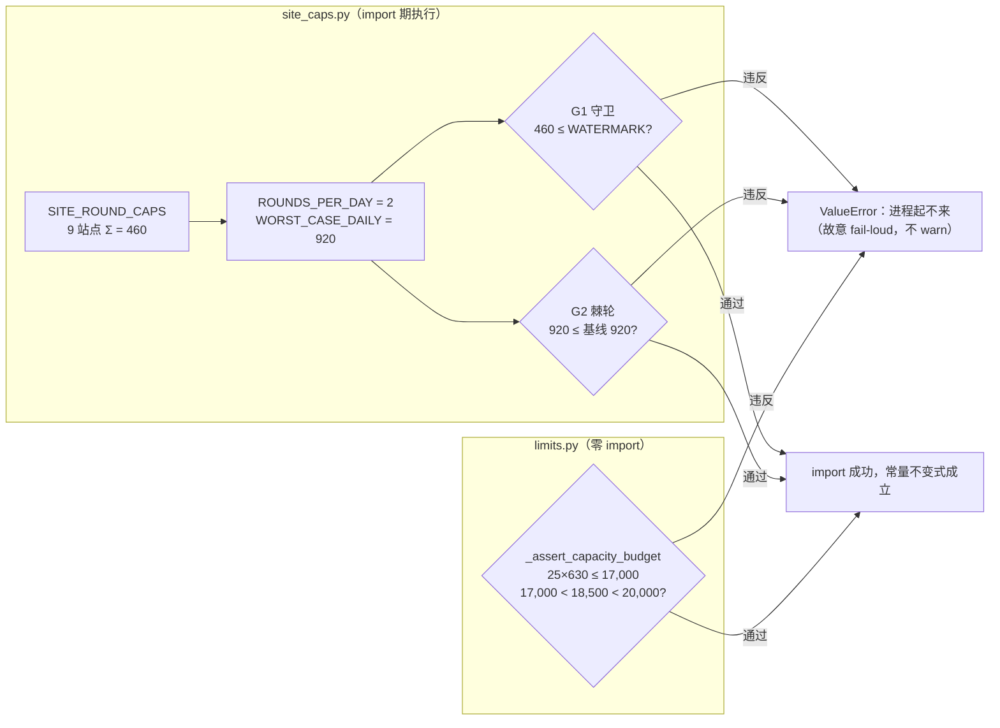
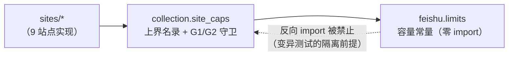
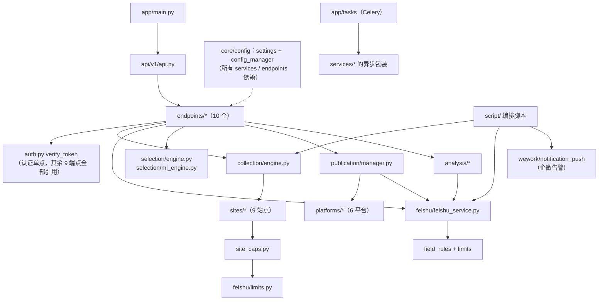

# 02 整体架构

## 1. 分层架构图

## 2. 核心数据流

## 3. 容量模型（本项目最重要的不变式）

### 3.1 常量（唯一来源：`app/services/feishu/limits.py`）

| 常量 | 值 | 含义 |
|---|---|---|
| `TABLE_RECORD_LIMIT` | 20,000 | 飞书单表硬上限（错误码 1254103） |
| `BATCH_WRITE_LIMIT` | 500 | 单次写接口上限（错误码 1254104） |
| `RETENTION_DAYS` | 25 | 目标保留窗口 |
| `DAILY_BUDGET` | 630 | 规划日量（**均值口径**，非上界口径） |
| `WATERMARK` | 17,000 | 容量水位：写前预检把表压到这里以下 |
| `WARNING` | 18,500 | 告警线 |
| `LIST_PAGE_SIZE` | 500 | 清理时分页读取大小 |

站点单轮上界（唯一来源：`app/services/collection/site_caps.py` `SITE_ROUND_CAPS`）：
people_daily 50 / xinhua 30 / cctv 50 / thepaper 100 / weibo 50 / baidu 50 / zhihu 50 / tech_36kr 50 / xiaohongshu 30，
**Σ(单轮) = 460**，按每天 2 轮 ⇒ 最坏日 **920** 条。

### 3.2 三条必须知道的算术事实

1. `Σ(上界) = 460 ≤ WATERMARK = 17,000` —— 单轮必然写得下。这是 **G1 守卫**（`site_caps.py:114`，import 期硬失败）。
2. `460 × 2 = 920 > DAILY_BUDGET = 630`，且 `> 17000/25 = 680` —— 「上界口径」装不进日预算；`DAILY_BUDGET` 是均值口径，不可写成硬断言。**G2 守卫**（`site_caps.py:126`）改为把最坏日上界**棘轮冻结**在 920：任何站点上限调大都会 import 期 raise。
3. `920 × 25 = 23,000 > 20,000` —— 「最坏情况下 25 天装不下」为真。实际净日增超过 680 时，写前预检会**最旧优先**压到水位（**比 25 天新的记录照删**），保留窗口随之压缩。

> 安全底线是 **G1（单轮可写）**，不是「日总账」；手动重跑不在「2 轮/天」之内。
> `limits.py` 自身还有 `_assert_capacity_budget()`（`limits.py:75`）：`RETENTION_DAYS × DAILY_BUDGET ≤ WATERMARK`、`WATERMARK < WARNING < TABLE_RECORD_LIMIT` 三条不变式，同样 import 期硬失败。
> **`limits.py` 保持零 import 是承重属性**（`test_capacity_budget.py` 靠「复制到临时目录 + 子进程 import」做变异测试），不得反向依赖任何模块。

守卫触发关系：

### 3.3 导入方向（单向、无环）

## 4. 模块依赖关系（import 视角）

关键耦合点：

- **认证单点**：`verify_token` 定义于 `app/api/v1/endpoints/auth.py:85`，其余 9 个端点模块全部 `from ...auth import verify_token`。
- **飞书写入收口**：所有写路径最终都走 `FeishuService.batch_add_records()`（`feishu_service.py:477`）——20,000 上限检查、500 分片、1254103 自愈重试都在这一处。
- **配置单点**：`config_manager`（sites/platforms/credentials/analysis 四个 yaml）与 `settings`（env/pydantic）双实例并存，见 [11-配置系统](11-配置系统.md)。

## 5. 三种运行形态

| 形态 | 入口 | 使用场景 | 说明 |
|---|---|---|---|
| **cron 批任务** | `script/run_daily_task.sh` / `script/scheduled_cleanup.sh` | **生产唯一实际执行路径** | openEuler 24.03 + Python 3.11.6，`/opt/apiserver`；无 systemd，改代码下次 cron 即生效 |
| **FastAPI 常驻** | `python -m app.main`（uvicorn） | 开发调试 / 手动触发接口 | `app/main.py`；`/docs` Swagger；依赖 Redis 做 health 检查（不可达时 status=degraded） |
| **Docker 容器** | `docker-compose.yml` | 容器化部署（与生产形态**不同**，勿混用） | 4 服务：`apiserver` / `redis` / `mongodb` / `playwright`；`deploy.sh` 做健康检查（服务名由 `test_deploy_service_names.py` 守护） |

## 6. 关键设计决策与已知缺口

| # | 决策/现状 | 细节 |
|---|---|---|
| 1 | **站点失败回退 mock，但三写入面都剔除** | `fallback_or_empty()`（`mock_utils.py:135`）默认生产返回空列表；`APISERVER_ALLOW_MOCK=1` 才产出带 `is_mock` 标记的演示数据；写入前由 `split_write_set`（`collection_pipeline.py:149`）、`build_headline_records`（`enhanced_collection.py:74`）、`split_real_and_mock`（`feishu.py:27`）过滤 |
| 2 | **写前容量预检只有一处** | `collection_pipeline.py:298` `ensure_capacity`；另两个写入面（`enhanced_collection.py:103/:272`、`POST /feishu/sync`）没有，唯一兜底是 `batch_add_records` 内部的 1254103 自愈重试（`feishu_service.py:532-546`） |
| 3 | **按 title 当日 upsert** | 只与当天记录比对，跨天重复是设计语义（用于观察热点持续天数） |
| 4 | **归档搬移不在调度内** | `manage_history_data.py` 需人工执行 |
| 5 | **重复实现** | `generate_content_id` 在 `app/utils/id_generator.py:13` 与 `secret/generate_auth_key.py:60` 各一份 |
| 6 | **站点 0 产出不判因** | 有站点级缺口告警（`collection_pipeline.py:113-120` 推企微），但无法区分「无新内容」与「静默失败」 |
| 7 | **死代码** | `app/api/v1/__init__.py:15` 的 `enhanced-collection` 前缀未被挂载（真实前缀是 `/enhanced`） |
| 8 | **硬编码路径** | `zhihu.py:43` 读 `/root/apiserver/config/zhihu.yaml`（绝对路径，生产靠软链兼容） |

## 7. 各模块详文档

采集 [04](04-采集模块.md) ｜ 飞书 [05](05-飞书模块.md) ｜ 选材 [06](06-选材模块.md) ｜ 发布 [07](07-发布模块.md) ｜ 分析 [08](08-分析模块.md)
