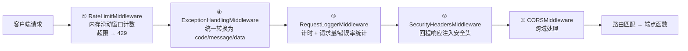

# 03 API 层与中间件

## 1. 应用入口 `app/main.py`

```python
app = FastAPI(
    title="智能体工作流API服务", version="1.0.0",
    docs_url="/docs", redoc_url="/redoc", lifespan=lifespan
)
```

**生命周期（`main.py:21` `lifespan`）**：启动时创建全局 `aiohttp.ClientSession` 挂到 `app.state.http_session`；关闭时释放。

**中间件注册（`main.py:50-63`，按 add 顺序）**：

```python
app.add_middleware(CORSMiddleware, ...)        # ①
app.add_middleware(SecurityHeadersMiddleware)  # ②
app.add_middleware(RequestLoggerMiddleware)    # ③
app.add_middleware(ExceptionHandlingMiddleware)# ④
app.add_middleware(RateLimitMiddleware)        # ⑤
```

> Starlette 语义：**后添加的在最外层**。实际请求处理顺序为 ⑤→④→③→②→①→路由，即：限流最先挡请求，异常处理包住业务，日志最贴近业务计时。



> 响应沿原路反向返回：安全头由 ② 注入、日志耗时由 ③ 在回程收口。

**服务级端点**：

| 路径 | 函数 | 行为 |
|---|---|---|
| `GET /` | `root()`（`main.py:71`） | 简单健康问候 |
| `GET /health` | `health_check()`（`main.py:81`） | 聚合 CPU/内存（psutil）、Redis ping、Celery worker 存活（`celery@*` keys），输出 `healthy/degraded/unhealthy` |
| `GET /metrics` | `get_metrics()`（`main.py:145`） | `metrics_collector.get_comprehensive_metrics()`：系统+应用+任务三类指标 |

**本地启动**：`main.py:152` `uvicorn.run("app.main:app", host=settings.HOST, port=settings.PORT, reload=settings.DEBUG, workers=settings.WORKERS)`，默认 `0.0.0.0:8000`。

## 2. 路由注册 `app/api/v1/api.py`

`api_router` 挂载 10 个子路由（`main.py:67` `prefix="/api/v1"`）：

| 模块 | prefix | tags | 说明 |
|---|---|---|---|
| `auth` | `/auth` | 认证 | 令牌校验/刷新 |
| `collection` | `/collection` | 采集 | 采集 + 站点列表；**content 端点复用此前缀** |
| `publication` | `/publication` | 发布 | |
| `selection` | `/selection` | 选材 | ⚠️ 端点内还有 `/selection` 段 ⇒ 真实路径出现重复段 `/api/v1/selection/selection` |
| `tasks` | `/tasks` | 任务管理 | Celery 任务提交/查询 |
| `feishu` | `/feishu` | 飞书集成 | |
| `analysis` | `/analysis` | 效果分析 | **insights 端点复用此前缀** |
| `enhanced_collection` | `/enhanced` | 增强采集 | 注意前缀是 `/enhanced` 不是 `/enhanced-collection` |
| `content` | `/collection` | 正文采集 | `/collection/content/fetch`、`/collection/content/backfill` |
| `insights` | `/analysis` | 深度内容 | `/analysis/insights/generate`、`/analysis/insights/preflight` |

> ⚠️ `app/api/v1/__init__.py:15` 中出现的 `enhanced-collection` 前缀是**未挂载的死代码**。
> ⚠️ `collection.py:26` 与 `publication.py:26` 用 `@router.get("/")` / `@router.post("/")`，注册路径含尾斜杠，Starlette `redirect_slashes` 会 307 重定向。

## 3. 认证机制

**依赖函数 `verify_token`（`endpoints/auth.py:85`）**：

```python
async def verify_token(credentials: HTTPAuthorizationCredentials = Depends(security))
```

- 从 `Authorization: Bearer <token>` 取凭证，校验通过返回 payload dict，失败抛 401。
- 被其余 9 个端点模块统一 `from app.api.v1.endpoints.auth import verify_token` 引用——**全接口的认证单点**。

**两套并存令牌（勿混）**：

| 机制 | 获取方式 | 有效期 | 用途 |
|---|---|---|---|
| 长效 authkey | `secret/generate_auth_key.py` 本地生成，记录在 `secret/auth_key.json` | 365 天 | 业务接口 `Authorization: Bearer <authkey>`；**没有申请令牌的 HTTP 端点** |
| 短效 access token | `POST /api/v1/auth/verify` 校验、`/refresh` 刷新 | `ACCESS_TOKEN_EXPIRE_MINUTES = 120` | JWT（HS256），`settings.SECRET_KEY` 签发 |

`verify_token` 的三段式校验时序（名单关 → JWT 解码 → 过期检查）：

```mermaid
sequenceDiagram
    autonumber
    participant C as 客户端
    participant V as verify_token
    participant K as auth_key.json 名单
    participant J as JWT 解码（HS256）
    C->>V: Authorization: Bearer &lt;token&gt;
    V->>V: token 命中内存缓存 _token_cache？
    alt 未命中缓存
        V->>K: load_valid_auth_keys() 查预设名单
        alt 不在名单
            V-->>C: 401（code 40101 无效的认证令牌）
        end
    else 已缓存
        Note over V: 跳过名单检查
    end
    V->>J: jwt.decode(token, secret, ALGORITHM)
    alt 解码抛 JWTError
        J-->>C: 401（code 40101）
    else 解码成功
        V->>V: 当前时间 > payload.exp？
        alt 已过期
            V->>V: 从 _token_cache 移除该令牌
            V-->>C: 401（code 40102 令牌已过期）
        else 未过期
            V-->>C: 返回 payload dict（放行到端点）
        end
    end
```

> 注意：长效 authkey 同样要通过 JWT 解码——名单只是第一道关，`auth_key.json` 中存放的是有效期 365 天的 JWT 形态令牌。

## 4. 端点明细（真实全路径）

### 4.1 认证 `endpoints/auth.py`

| 方法+路径 | 函数（行号） | 说明 |
|---|---|---|
| `POST /api/v1/auth/verify` | `verify_access_token`（`auth.py:137`） | 校验 JWT |
| `POST /api/v1/auth/refresh` | `refresh_access_token`（`auth.py:156`） | 刷新令牌 |

### 4.2 采集 `endpoints/collection.py`

| 方法+路径 | 函数（行号） | 说明 |
|---|---|---|
| `GET /api/v1/collection` | `collect_website_info`（`collection.py:27`） | 参数：`site_code`（逗号分隔）、`date`、`category`、`keyword`；调 `CollectionEngine.collect()`，结果经 `hotspot_enrich` 增强为飞书兼容格式（`hotspot_id/hot_level/content_quality` 等字段） |
| `GET /api/v1/collection/sites` | `get_available_sites`（`collection.py:133`） | 列出 `sites.yaml` 中已启用站点 |

### 4.3 正文 `endpoints/content.py`

| 方法+路径 | 函数（行号） | 说明 |
|---|---|---|
| `POST /api/v1/collection/content/fetch` | `fetch_content`（`content.py:114`） | 请求模型 `ContentFetchRequest`（`content.py:40`）：`urls / record_ids / site_code / write_back / overwrite / concurrency / timeout`；加载飞书 headlines 索引 → `ContentFetcher.fetch_many()` → 可选回写正文 |
| `POST /api/v1/collection/content/backfill` | `backfill_content`（`content.py:204`） | 请求模型 `ContentBackfillRequest`；扫描 content 为空的 headlines 记录，限量回填 |

### 4.4 增强采集 `endpoints/enhanced_collection.py`

| 方法+路径 | 函数（行号） | 说明 |
|---|---|---|
| `GET /api/v1/enhanced/collect-and-store` | `collect_and_store`（`enhanced_collection.py:36`） | 采集 → `build_headline_records()`（`:74`，mock 过滤）→ `ensure_table_fields()` → `batch_add_records()` 直接入库；⚠️ 该写入面**无容量预检** |
| `POST /api/v1/enhanced/select-and-store` | `select_and_store`（`enhanced_collection.py:135`） | 从飞书 headlines 拉热点 → 转选材引擎输入 → `SelectionEngine.analyze_hotspots()` → 结果入库 |

### 4.5 选材 `endpoints/selection.py`

| 方法+路径 | 函数（行号） | 说明 |
|---|---|---|
| `POST /api/v1/selection/selection` | `analyze_hotspots`（`selection.py:130`） | 请求模型 `SelectionRequest`；`HotspotItem`（`:21`）用 `AliasChoices` 兼容两套热点字段命名（canonical 键转换后进入引擎） |
| `GET /api/v1/selection/selection/platforms` | `get_supported_platforms`（`selection.py:258`） | 平台列表 |
| `GET /api/v1/selection/selection/strategies` | `get_content_strategies`（`selection.py:294`） | 策略列表 |

### 4.6 发布 `endpoints/publication.py`

| 方法+路径 | 函数（行号） | 说明 |
|---|---|---|
| `POST /api/v1/publication` | `publish_content`（`publication.py:27`） | 请求模型 `PublicationRequest`（`:19`）：`platform / platform_credentials / content`；调 `PublicationManager.publish()` |
| `GET /api/v1/publication/platforms` | `get_available_platforms`（`publication.py:78`） | 发布平台列表 |

### 4.7 任务 `endpoints/tasks.py`

| 方法+路径 | 函数（行号） | 说明 |
|---|---|---|
| `POST /api/v1/tasks/submit` | `submit_task`（`tasks.py:77`） | 请求模型 `TaskSubmitRequest`；按 `collection/selection/publication` 类型分发 Celery 任务（`app/tasks/`），返回 `TaskResponse` |
| `GET /api/v1/tasks/status/{task_id}` | `get_task_status`（`tasks.py:175`） | 查询 AsyncResult 状态 |
| `GET /api/v1/tasks/metrics` | `get_task_metrics`（`tasks.py:223`） | `TaskMetrics` 汇总 |

### 4.8 飞书 / 分析 / 深度内容

| 方法+路径 | 函数（行号） | 说明 |
|---|---|---|
| `POST /api/v1/feishu/sync` | `sync_to_feishu`（`feishu.py:13`） | 接收记录列表 → `split_real_and_mock`（`:27`）过滤 → `ensure_table_fields()` + `batch_add_records()`；⚠️ **无容量预检** |
| `POST /api/v1/analysis/collect` | `collect_data`（`analysis.py:25`） | 效果分析数据采集（`AnalysisService`） |
| `GET /api/v1/analysis/report/{platform}/{publication_id}` | `get_analysis_report`（`analysis.py:51`） | 发布效果报告 |
| `POST /api/v1/analysis/insights/generate` | `generate_insights`（`insights.py:56`） | 请求模型 `InsightsGenerateRequest`；生成 ai_insights 深度内容并写入飞书 |
| `GET /api/v1/analysis/insights/preflight` | `insights_preflight`（`insights.py:80`） | 深度内容生成前置检查（配置/表/LLM 可用性） |

> 端点与服务的依赖连线汇总见 [02-整体架构](02-整体架构.md) §4。

## 5. 中间件（`app/middleware/`）

### 5.1 已注册的 4 个

| 中间件 | 类（行号） | 机制 | 要点 |
|---|---|---|---|
| 限流 | `RateLimitMiddleware`（`rate_limiter.py:14`，BaseHTTPMiddleware） | 内存计数 | `_setup_rate_limits()`（`:22`）初始化路径级规则；`_get_rate_limit_rule(path)`（`:69`）匹配规则；`_check_rate_limit(rule_key, client_ip)`（`:78`）滑动窗口判定，超限 429。默认 `RATE_LIMIT_PER_MINUTE=60`、`PER_HOUR=1000` |
| 异常处理 | `ExceptionHandlingMiddleware`（`exception_handler.py:14`） | dispatch 全捕获 | 统一转换为 `{code, message, data}` 响应结构，避免堆栈外泄 |
| 请求日志 | `RequestLoggerMiddleware`（`request_logger.py:14`） | 计时 | 记录方法/路径/客户端/状态码/耗时；内置 `PerformanceMetrics`（`:78`）做请求量与错误率统计 |
| 安全响应头 | `SecurityHeadersMiddleware`（`security.py:124`） | dispatch 注入 | 为所有响应加 `X-Content-Type-Options / X-Frame-Options / Cache-Control` 等安全头 |

### 5.2 存在但**未注册**的 2 个（`security.py`）

| 中间件 | 行号 | 说明 |
|---|---|---|
| `SignatureVerificationMiddleware` | `security.py:14` | 请求体签名校验（配合 `utils/crypto.RequestSigner`），当前未挂载 |
| `IPWhitelistMiddleware` | `security.py:93` | IP 白名单，当前未挂载 |

## 6. 通用依赖 `app/api/v1/dependencies.py`

仅一个工具函数：

```python
def create_http_exception(code: int, message: str) -> HTTPException
```

构造统一 `{code, message, data: None}` 格式的 400 异常（`dependencies.py:8`）。注意：`verify_token` **不在**这里，而在 `auth.py:85`。
