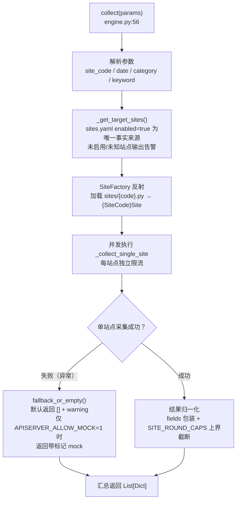
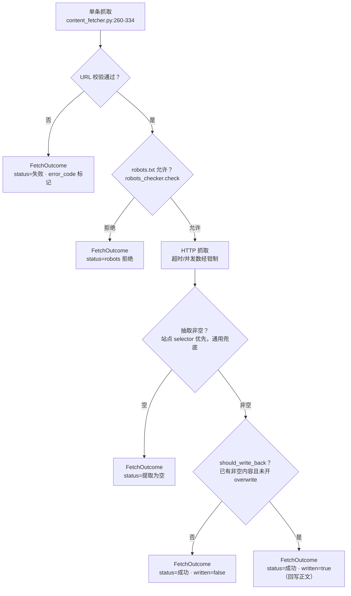
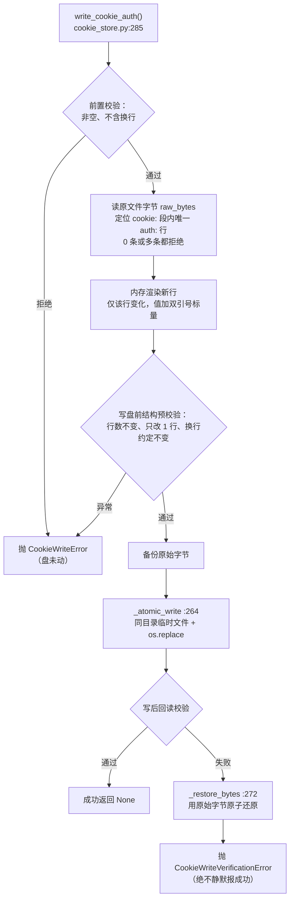

# 04 采集模块（app/services/collection/）

## 1. 模块结构

```
collection/
├── engine.py            采集引擎 + SiteFactory（调度核心）
├── site_caps.py         站点单轮上界名录 + G1/G2 容量守卫（import 期硬失败）
├── write_set.py         写入集构造：展平结果 + mock/真实拆分
├── mock_utils.py        mock 治理：opt-in、标记、识别、拆分、失败回退
├── robots_checker.py    robots.txt 合规检查
├── cookie_store.py      知乎 cookie 解析/原子写回（带验证与备份）
├── content_fetcher.py   正文按需抓取编排（FetchItem/FetchOutcome/ContentFetcher）
├── content_extractor.py 正文提取（stdlib HTMLParser，零三方依赖）
└── sites/               9 个站点实现 + base.py 基类
```

## 2. 站点基类 `sites/base.py`

```python
class BaseSite(ABC):            # base.py:13
```

- 抽象方法 `collect()`：子类契约，返回归一化记录列表。
- 提供 HTTP `ClientSession` 复用、资源清理（`__aexit__`）、当前时间生成与基础结果校验。
- 每个记录最终带 `fields` 包装结构（飞书写入层要求的形状，`thepaper.py:136-151` 有补齐示范）。

## 3. 采集引擎 `engine.py`

### 3.1 CollectionEngine（`engine.py:17`）

| 方法（行号） | 职责 |
|---|---|
| `__init__()`（`:20`） | 初始化限流器与站点配置 |
| `_init_rate_limiters()`（`:26`） | 每站点请求限流参数 |
| `_load_sites_config()`（`:38`） | 从 `config_manager.get_sites_config()` 读 `sites.yaml` |
| `async collect(params) -> List[Dict]`（`:56`） | **主入口**：解析参数 → 选目标站点 → 并发执行 `_collect_single_site` → 异常捕获 + 结果归一化 |
| `async _collect_single_site(site_code, date, params, site_config)`（`:98`） | 单站点采集；失败走 `fallback_or_empty()` 回退 |
| `_get_target_sites(site_code_input)`（`:146`） | 名单决策：`sites.yaml` 中 `enabled=true` 的站点为唯一事实来源；支持单字符串/列表输入；未启用或未知站点输出告警 |

### 3.2 SiteFactory（`engine.py:225`）

按 `site_code` 动态加载 `sites/{site_code}.py`，按**约定类名** `{SiteCode}Site` 反射创建实例（如 `thepaper` → `ThepaperSite`）。

`collect()` 主流程：



## 4. 九个站点实现（sites/）

| 站点 | 类（行号） | 单轮上界 | 采集方式 | 特殊逻辑 |
|---|---|---|---|---|
| 人民日报 | `PeopleDailySite`（`people_daily.py:22`） | 50 | RSS | `_MAX = SITE_ROUND_CAPS["people_daily"]` |
| 新华社 | `XinhuaSite`（`xinhua.py:24`） | 30 | API/页面 | |
| 央视新闻 | `CctvSite`（`cctv.py:23`） | 50 | API | |
| 澎湃新闻 | `ThepaperSite`（`thepaper.py:32`） | 100 | API | `MAX_RESULTS = SITE_ROUND_CAPS["thepaper"]`（`:29`）；返回前强制截断 + `fields` 包装（`:136-151`），异常后仍守上界 |
| 微博热搜 | `WeiboSite`（`weibo.py:31`） | 50 | **Playwright**（JS 渲染页） | 三条返回路径最终上界均为 50（`:19-22` 注释）；需 `playwright install chromium` |
| 百度热搜 | `BaiduSite`（`baidu.py:25`） | 50 | API | |
| 知乎热榜 | `ZhihuSite`（`zhihu.py:33`） | 50 | API + cookie | 配置读**硬编码绝对路径** `/root/apiserver/config/zhihu.yaml`（`:40-48`）；可由 `collection.result_limit`（**嵌套键**）覆盖 |
| 36氪 | `Tech36krSite`（`tech_36kr.py:22`） | 50 | RSS | |
| 小红书 | `XiaohongshuSite`（`xiaohongshu.py:28`） | 30 | MCP/解析 | 逻辑最重（35KB），配套根目录 `parse_xiaohongshu_mcp.py` |

> 上界的唯一来源是 `site_caps.py`——站点模块通过 `SITE_ROUND_CAPS[...]` 取值，**不得在站点内另写字面量**（`tests/test_site_caps_budget.py` 锁闭包）。

## 5. 容量守卫 `site_caps.py`

```python
SITE_ROUND_CAPS = { "people_daily": 50, "xinhua": 30, "cctv": 50, "thepaper": 100,
                    "weibo": 50, "baidu": 50, "zhihu": 50, "tech_36kr": 50, "xiaohongshu": 30 }
ROUNDS_PER_DAY = 2
PER_ROUND_CAP_TOTAL = sum(...)   # 460
WORST_CASE_DAILY = 460 × 2       # 920
ACKNOWLEDGED_WORST_CASE_DAILY = 920   # G2 棘轮基线
```

| 函数（行号） | 断言 |
|---|---|
| `cap_for(site_code)`（`:71`） | 查询接口；未登记抛 KeyError（名录闭包） |
| `_assert_registry_sane()`（`:89`） | 键非空字符串、值为正整数（显式排除 bool） |
| `_assert_capacity_guards()`（`:105`） | **G1**：`PER_ROUND_CAP_TOTAL ≤ limits.WATERMARK`（单轮必然写得下）；**G2**：`WORST_CASE_DAILY ≤ 920`（任何站点上限调大 → raise，逼迫开发者复算保留窗口） |

**语义边界**（模块头注释，`site_caps.py:1-32`）：只登记「collect() 最终返回条数上界」的【终】字面量；【预】预筛上限、【阈】阈值/早停、【分】分页大小**不得**登记（会改变采集行为）。导入方向单向：`sites/* → site_caps → feishu.limits`。

## 6. mock 治理 `mock_utils.py` + `write_set.py`

| 函数（行号） | 职责 |
|---|---|
| `mock_allowed()`（`mock_utils.py:41`） | 环境变量 `APISERVER_ALLOW_MOCK=1` 才允许产出 mock |
| `is_mock_record(record)`（`:63`） | 双重识别：顶层 `is_mock` 或嵌套 `fields.is_mock` |
| `split_real_and_mock(records)`（`:87`） | 按标记拆成 (真实, mock) 两组 |
| `tag_mock(items)`（`:106`） | 给演示数据打标记 |
| `fallback_or_empty(...)`（`:135`） | **统一失败回退入口**：默认（生产）返回 `[]` 并 warning；仅 opt-in 时返回带标记 mock |
| `split_write_set(...)`（`write_set.py:26-45`，pipeline 内为 `collection_pipeline.py:149`） | 展平 `collect()` 结果并拆分，确保 mock 不进入入库集 |

三个写入面的过滤接线由 `tests/test_write_path_wiring.py` 锁住；动态枚举所有含 `_get_mock_data` 的站点、强制 opt-in 由 `test_mock_governance.py` / `test_mock_optin.py` 锁住。

## 7. 正文抓取子管道

### 7.1 `content_fetcher.py`

| 类/函数（行号） | 职责 |
|---|---|
| `FetchItem`（`:53`） | 单条抓取任务（url/record_id/site_code 等） |
| `FetchOutcome`（`:62`） | 结果对象：状态归类（成功/robots 拒绝/HTTP 失败/提取为空…），`to_dict()`（`:78`） |
| `should_write_back(existing, new, overwrite)`（`:99`） | 回写决策：已有非空内容且未开 overwrite 时不覆盖 |
| `infer_site_code(url, sites_config)`（`:137`） | 按 host 推断站点代码（用于选站点 selector） |
| `ContentFetcher`（`:181`） | **编排器**：`__init__` 注入 extractor / robots checker / HTTP getter / 站点配置 / 并发与超时（`:184`，有 `_clamp_concurrency/_clamp_timeout` 边界钳制）；`fetch_many()` 并发批量；单条流程（`:260-334`）：URL 校验 → robots 检查 → HTTP 抓取 → 正文抽取 → 错误状态归类（**失败不抛异常**，返回 FetchOutcome） |

单条抓取流程（失败路径一律收敛为带状态码的 `FetchOutcome`，不抛异常）：



### 7.2 `content_extractor.py`

| 类（行号） | 职责 |
|---|---|
| `ExtractResult`（`:32`） | 提取结果（文本 + 元信息） |
| `_HtmlCollector(HTMLParser)`（`:40`） | stdlib 流式收集器：支持站点 selector（`:48`）与 generic 模式；跳过 script/style 等噪声标签（`:62`） |
| `ContentExtractor`（`:138`） | `extract(html, selector)`（`:146`）：**优先站点配置 selector，未命中走通用兜底**；`match_selector`（`:192`）支持简单属性选择器匹配 |

设计要点：基于标准库 `html.parser`，**不依赖** bs4/lxml（这两个在 requirements 里供其他用途）。

### 7.3 `robots_checker.py`

`check(url)` 流程（`:19-54`）：解析域名 → 拉取 robots.txt → 解析规则 → 判定目标路径是否允许抓取。`ContentFetcher` 在每次抓取前调用。

## 8. 知乎 cookie 存储 `cookie_store.py`

**用途**：知乎热榜采集需要登录态 cookie；cookie 过期后由 `script/zhihu_cookie_tool.py`（人工）+ 本模块完成更新落盘。

| 函数/类（行号） | 职责 |
|---|---|
| `parse_cookie_header(raw)`（`:92`） | header 字符串 → dict |
| `format_cookie_header(cookies)`（`:114`） | dict → header 字符串 |
| `read_cookie_auth(yaml_path)`（`:138`） | 从 zhihu.yaml 读 `cookie.auth` |
| `write_cookie_auth(yaml_path, cookie_str, backup_path)`（`:285`） | **核心写回**：只改 `cookie.auth` 一个键、保留其余字节与换行、原子写（`_atomic_write :264`）、写后回读校验（`_restore_bytes :272` 兜底回滚） |
| 异常族（`:56-77`） | `CookieConfigError` / `CookieAuthMissingError` / `CookieWriteError` / `CookieWriteVerificationError` |
| `notify(message)`（`:397`） | cookie 更新企微通知 |

**设计红线**（模块头 `:9-21`）：`cookie.auth` 唯一、其余配置字节不变、保留换行、写后回读校验、幂等事务性。由 `tests/test_zhihu_cookie_refresh.py` 守护。

`write_cookie_auth()` 事务性写回流程（每条拒绝路径都保证文件逐字节等于调用前）：



## 9. 相关文档

- 容量模型全貌：[02-整体架构](02-整体架构.md) §3
- 飞书写入收口：[05-飞书模块](05-飞书模块.md)
- 生产采集链路（pipeline 脚本视角）：[12-脚本与运维](12-脚本与运维.md)
- 守卫的测试锁：[13-测试体系](13-测试体系.md)
