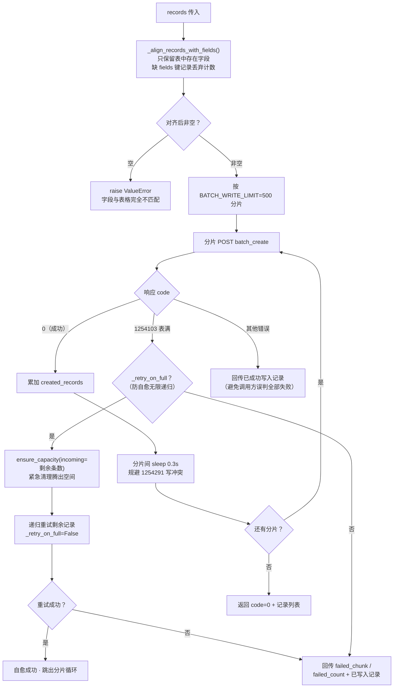
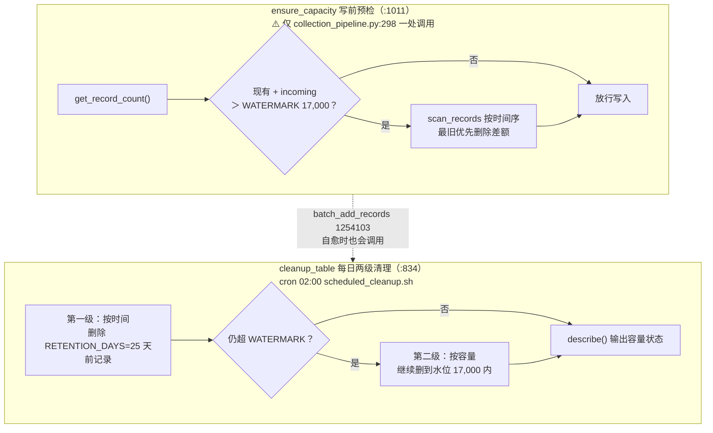
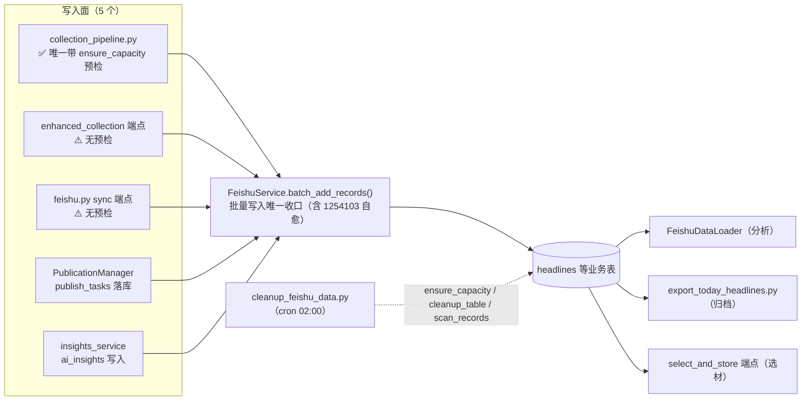

# 05 飞书模块（app/services/feishu/）

## 1. 模块结构

```
feishu/
├── feishu_service.py   核心服务：token、字段、记录 CRUD、清理、容量预检（47KB）
├── field_rules.py      字段规划：BASE_FIELD_DEFINITIONS + TABLE_PLANS（8 张表）
├── limits.py           容量常量唯一来源 + import 期不变式（零 import 承重模块）
└── function/           表初始化与调试脚本（init/test/generate/update user token）
```

飞书多维表格是全项目的**数据底座**：`headlines`（热点）、`ai_insights`（深度内容）、`content_selection`（选材）、`publish_tasks`（发布）、`distribution`、`platform_configs`、`data_sources`、`content_evaluation` 共 8 张业务表。

## 2. FeishuService（feishu_service.py:80）

### 2.1 对接的外部 API（`feishu_service.py:22-29` 常量）

| 用途 | 端点（open.feishu.cn） |
|---|---|
| tenant token | `/open-apis/auth/v3/tenant_access_token/internal` |
| 批量新增记录 | `/open-apis/bitable/v1/apps/{app_token}/tables/{table_id}/records/batch_create` |
| 批量更新记录 | `/open-apis/bitable/v1/apps/.../records/batch_update` |
| 批量删除记录 | `/open-apis/bitable/v1/apps/.../records/batch_delete` |
| 字段列表/新建/删除 | `/open-apis/bitable/v1/apps/.../fields` |

### 2.2 方法全表

| 方法（行号） | 职责 |
|---|---|
| `__init__()`（`:81`） | 从 `config_manager.get_credentials()` 读 `app_id/app_secret` 与表配置 |
| `async get_tenant_access_token() -> str`（`:99`） | 获取并缓存 tenant token |
| `async delete_field(app_token, table_id, field_id) -> bool`（`:127`） | 删除字段（配合字段规划做多余字段清理） |
| `def _get_table_fields_sync(...)`（`:166`） | 同步版字段读取（线程池用） |
| `async get_table_fields(app_token, table_id)`（`:189`） | 读字段（**带缓存**） |
| `async create_field(app_token, table_id, ...)`（`:195`） | 新建字段（按 field_rules 定义） |
| `async list_records(app_token, table_id, page_size=10, page_token=None)`（`:263`） | 分页读记录 |
| `def _align_records_with_fields(records, table_fields_set)`（`:292`） | **写前对齐**：只保留表中存在的字段；缺 `fields` 键的记录丢弃计数并告警，避免静默入库失败 |
| `async ensure_table_fields(app_token, table_id, required_fields, table_name)`（`:340`） | 字段同步：按 TABLE_PLANS 补建缺失字段、删除多余字段 |
| `async get_table_fields_uncached(...)`（`:456`） | 绕过缓存的字段读取 |
| `async batch_add_records(app_token, table_id, records, ...)`（`:477`） | **批量写入唯一收口**（详见 2.3） |
| `async batch_update_records(app_token, table_id, ...)`（`:580`） | 按 `record_id` 更新；⚠️ 请求体形状与 create/delete 不同（`:580-609` 注释强调勿混用） |
| `async scan_records(app_token, table_id, ...)`（`:743`） | 按时间排序分页扫描（清理用，`LIST_PAGE_SIZE=500`） |
| `async get_record_count(app_token, table_id) -> int`（`:771`） | 表内记录总数 |
| `async delete_records(app_token, table_id, ...)`（`:776`） | 批量删除 |
| `async cleanup_table(app_token, table_id, ...)`（`:834`） | 两级清理：按时间（25 天）+ 按容量（压到 WATERMARK） |
| `async ensure_capacity(app_token, table_id, ...)`（`:1011`） | **写前容量预检**：`get_record_count` → 若 `现有 + incoming > WATERMARK` 则最旧优先删差额（⚠️ 只在 `collection_pipeline.py:298` 一处被调用） |

### 2.3 batch_add_records 写入协议（`:477-560`）



这是全项目写飞书的**唯一收口**：三个写入面（pipeline / enhanced 端点 / feishu sync 端点）最终都到这里；1254103 自愈重试是对「另两个写入面没有 ensure_capacity 预检」的兜底。

## 3. 字段规划 `field_rules.py`

- `BASE_FIELD_DEFINITIONS`（`:2-118`）：全部基础字段的定义集合——标题、正文、作者、分类、热度、排名、采集/发布时间、平台状态、AI 分析、发布任务等。
- `TABLE_PLANS`（`:121-216`）：每张表声明需同步的显式字段列表，覆盖 8 张表：`headlines` / `ai_insights` / `distribution` / `platform_configs` / `content_selection` / `data_sources` / `publish_tasks` / `content_evaluation`。`ensure_table_fields()` 据此做「补建缺失 + 删除多余」。
- `_resolve_fields(keywords=None, explicit=None)`（`:122`）：字段解析辅助。

> 表结构设计详见 `doc/飞书多维表格设计文档.md`。

## 4. 容量常量 `limits.py`

```python
TABLE_RECORD_LIMIT = 20_000   # 单表硬上限（1254103）
BATCH_WRITE_LIMIT  = 500      # 单次写接口上限（1254104）
RETENTION_DAYS     = 25       # 保留窗口（由 35 天收紧）
DAILY_BUDGET       = 630      # 规划日量（均值口径）
WATERMARK          = 17_000   # 安全水位（仅留 15% 余量）
WARNING            = 18_500   # 告警线
LIST_PAGE_SIZE     = 500      # 清理分页大小
```

| 函数（行号） | 职责 |
|---|---|
| `_assert_capacity_budget()`（`:75`） | import 期三条不变式：`RETENTION_DAYS × DAILY_BUDGET ≤ WATERMARK`；`WATERMARK < WARNING`；`WARNING < TABLE_RECORD_LIMIT`。**故意硬失败**（历史教训：常量静默超限导致表格卡死 3 个月） |
| `is_safe(count)`（`:111`） | `count < WATERMARK` |
| `describe(count)`（`:116`） | 人类可读容量描述（✅正常/⚠️偏高/🚨危险/🚨已达上限 + 百分比），用于日志与通知 |

> ⚠️ **本模块零 import 是承重属性**：`tests/test_capacity_budget.py` 把它复制到临时目录 + 子进程 import 做文本变异测试，任何反向依赖都会破坏该前提。
> ⚠️ 历史包袱：`script/smart_cleanup.py` 旧阈值 80,000/95,000/100,000 是把上限误当 100,000 的产物，已废弃——一切以本模块为准。

写前预检与每日清理的协作关系：



## 5. function/ 目录（初始化与调试）

| 脚本 | 用途 |
|---|---|
| `init_all_feishu_tables.py` / `init_feishu_table.py` | 按 TABLE_PLANS 批量/单表初始化 |
| `generate_feishu_curl.py` | 生成调试用 curl 命令 |
| `comprehensive_feishu_test.py` / `test_full_flow_to_feishu.py` / `test_collection_sync.py` | 端到端连通性测试（**有副作用**，写真实表） |
| `test_feishu_connection.py` / `test_create_feishu_field.py` / `test_delete_feishu_field.py` / `test_delete_specific_field.py` | 单点功能验证 |
| `test_user_token.py` / `update_user_token.py` / `update_user_token_cli.py` | 用户访问令牌获取与更新（流程见 `doc/飞书用户访问令牌获取指南.md`） |

## 6. 与其他模块的关系



容量模型与守卫体系见 [02-整体架构](02-整体架构.md) §3。
