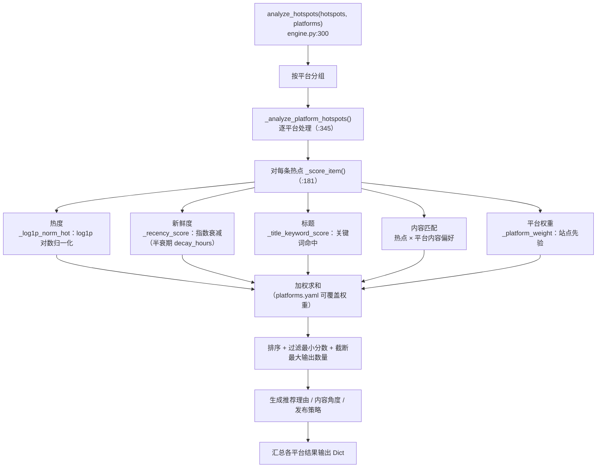
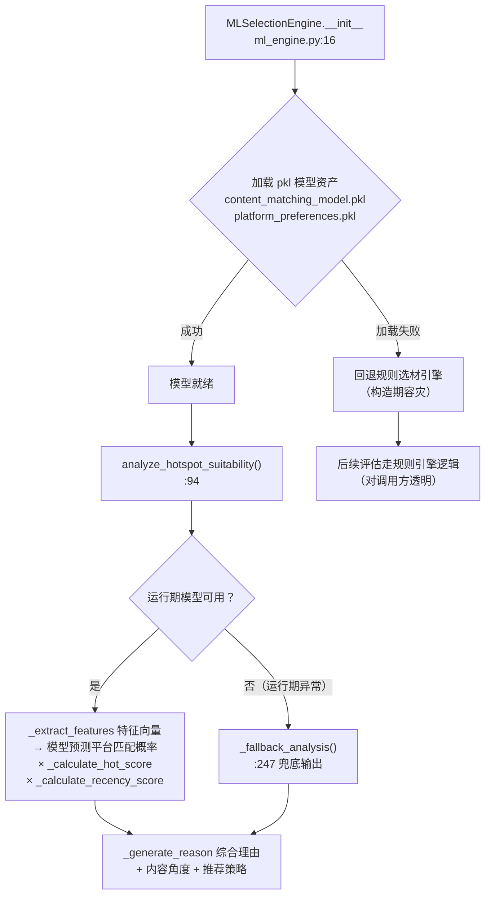

# 06 选材模块（app/services/selection/）

## 1. 模块结构

```
selection/
├── engine.py     规则选材引擎（五维打分，生产默认）
└── ml_engine.py  ML 选材引擎（pkl 模型预测，失败自动回退规则引擎）
```

两个引擎对外提供**同名方法** `analyze_hotspot_suitability(hotspot, platform)`，调用方可无缝切换。

## 2. SelectionEngine（engine.py:25）

### 2.1 五维打分模型

`_score_item(item, cfg, platform_config)`（`engine.py:181`）输出得分明细 `hot / recency / title / content_match / platform`：

| 维度 | 方法（行号） | 算法 |
|---|---|---|
| 热度 | `_log1p_norm_hot(hot)`（`:86`） | 热度值 **log1p 对数归一化**（压缩量纲差异） |
| 新鲜度 | `_recency_score(collected_at, decay_hours)`（`:96`） | **指数衰减**（半衰期由配置 `decay_hours` 控制） |
| 标题 | `_title_keyword_score(title)`（`:114`） | 关键词命中计分 |
| 内容匹配 | `_content_match_score(item, platform_config)`（`:135`） | 热点与平台内容偏好的匹配度 |
| 平台权重 | `_platform_weight(site_code, cfg)`（`:131`） | 站点在某平台的先验权重 |

支持平台特定 `scoring_weights` 覆盖默认权重（`_load_configs()` `:40` 从 `config/platforms.yaml` 读取）。

`analyze_hotspots()` 五维打分流程：



## 2.2 关键方法

| 方法（行号） | 职责 |
|---|---|
| `__init__()`（`:28`） | 加载默认配置与平台配置 |
| `_load_configs()`（`:40`） | 读 `platforms.yaml`（平台定义、权重、关键词、内容偏好） |
| `async analyze_hotspots(hotspots, platforms=None) -> Dict`（`:300`） | **主入口**：按平台分组 → `_analyze_platform_hotspots()`（`:345`）逐平台打分排序 → 汇总输出 |
| `analyze_hotspot_suitability(hotspot, platform) -> Dict`（`:229`） | 单热点单平台评估（打分 + 推荐理由 + 内容角度 + 策略） |
| `_generate_recommendation_reason_simple(score, breakdown)`（`:269`） | 按得分区间生成推荐理由文案 |
| `_generate_content_angle(hotspot, platform_config)`（`:394`） | 生成内容创作角度建议 |
| `_recommend_strategy(hotspot, platform_config, ...)`（`:420`） | 推荐发布策略 |

默认配置（`engine.py:13-21`）：热度/新鲜度/标题/平台权重 + 衰减时间 + 最小分数 + 最大输出数量。

## 3. MLSelectionEngine（ml_engine.py:13）

### 3.1 模型资产（项目根目录）

| 文件 | 用途 |
|---|---|
| `content_matching_model.pkl` | 内容-平台匹配分类模型（scikit-learn） |
| `platform_preferences.pkl` | 平台偏好特征 |

训练脚本：根目录 `train_content_matching_model.py`（jieba 分词 + sklearn；**未部署生产**，生产实测已装 sklearn/joblib/numpy/pandas 供 `ml_engine.py` 运行时使用）。

### 3.2 关键方法

| 方法（行号） | 职责 |
|---|---|
| `__init__(model_path, ...)`（`:16`） | 加载两个 pkl；**加载失败回退规则选材引擎**（容灾设计） |
| `_load_configs()`（`:42`） | 平台偏好配置 |
| `_preprocess_text(text)`（`:60`） | 文本预处理 |
| `_extract_features(item, platform) -> List[float]`（`:70`） | 提取平台偏好匹配特征向量 |
| `analyze_hotspot_suitability(hotspot, platform) -> Dict`（`:94`） | **主入口**：特征提取 → 模型预测概率 → 与热度/时效综合 → 输出内容角度、推荐策略、推荐理由 |
| `_calculate_hot_score(hotspot)`（`:151`） / `_calculate_recency_score(hotspot)`（`:165`） | 与规则引擎同源的辅助分 |
| `_generate_reason(platform_prob, hot_score, recency_score)`（`:189`） | 综合理由生成 |
| `_generate_content_angle(hotspot, platform)`（`:214`） / `_recommend_strategy(platform)`（`:231`） | 角度与策略建议 |
| `_fallback_analysis(hotspot, platform)`（`:247`） | 模型不可用时的兜底输出 |

ML 引擎的两级容灾路径：



## 4. 调用方

| 调用方 | 场景 |
|---|---|
| `POST /api/v1/selection/selection`（`selection.py:130`） | HTTP 触发选材（`HotspotItem` 用 `AliasChoices` 兼容两套字段命名） |
| `POST /api/v1/enhanced/select-and-store`（`enhanced_collection.py:135`） | 从飞书 headlines 拉数据选材并入库 `content_selection` 表 |
| `app/tasks/selection_tasks.py` | Celery 异步选材（batch/platform_specific/strategy/quality 四个任务） |

## 5. 相关文档

- 选材设计：`doc/选材引擎规划.md`、`doc/平台差异化布局设计.md`
- 模型训练：`doc/ml_training_guide.md`
- 平台配置结构：[11-配置系统](11-配置系统.md)
