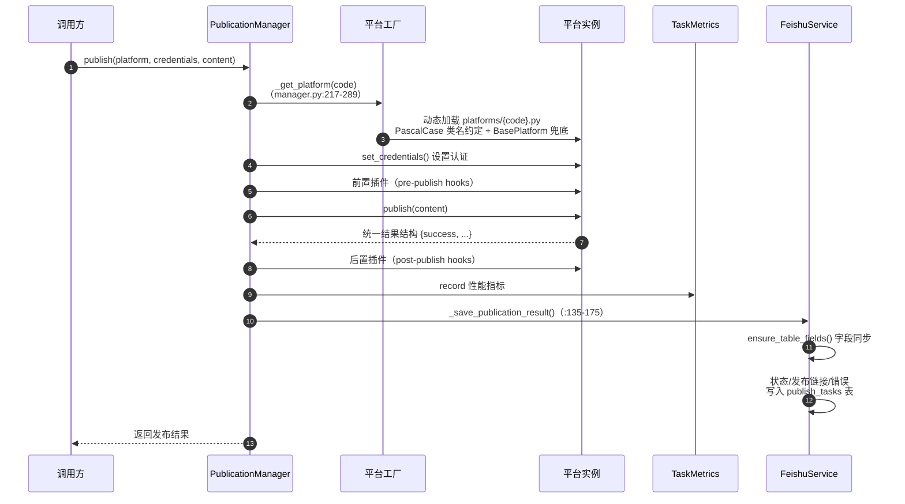

# 07 发布模块（app/services/publication/）

## 1. 模块结构

```
publication/
├── manager.py     发布管理器：编排一次多平台发布的完整生命周期
└── platforms/
    ├── base.py        发布平台基类契约
    ├── zhihu.py       知乎
    ├── xiaohongshu.py 小红书
    ├── wechat_public.py 微信公众号
    ├── weibo.py       微博
    ├── toutiao.py     今日头条
    └── juejin.py      掘金
```

## 2. PublicationManager（manager.py:18）

### 2.1 发布主流程 `publish()`（`manager.py:58-124`）



### 2.2 关键方法

| 方法（行号） | 职责 |
|---|---|
| `__init__()`（`:18`） | 加载平台配置：兼容 `publish_platforms` / `platforms` 两个配置键（`config/platforms.yaml`），为空时使用默认 fallback |
| `publish(...)`（`:58`） | 主流程（见上） |
| `_save_publication_result(...)`（`:135`） | 发布结果落库飞书 `publish_tasks` 表（成功/失败状态、发布链接、错误信息） |
| 平台工厂（`:217-289`） | 按平台代码动态加载 `platforms/{code}.py`；**PascalCase 类名约定**（如 `zhihu` → `ZhihuPlatform`）+ `BasePlatform` 子类兜底匹配 |

## 3. BasePlatform（platforms/base.py:11）

发布平台基类契约：

- 抽象方法 `publish()`——子类必须实现。
- HTTP session 管理 + 资源清理（async context）。
- 内容验证（`_validate_content`）与字段映射（`_map_fields`）辅助。
- **统一结果结构**：所有平台返回同形状的 `{success, ...}` dict，屏蔽各平台 API 差异。

## 4. 六个平台实现

| 平台 | 文件 | 认证方式 | 实现要点 |
|---|---|---|---|
| 知乎 | `zhihu.py`（实现 `:18-75`） | `access_token` | 内容验证 → 字段映射 → 知乎 API → 解析成功/失败响应 |
| 小红书 | `xiaohongshu.py`（`:18-86`） | 平台凭证 | 兼容 `success` 与 `code==0` **两种成功约定**；解析 `note_id`/URL；处理图片、标题、正文 |
| 微信公众号 | `wechat_public.py` | access_token | 公众号素材/发布接口 |
| 微博 | `weibo.py` | OAuth | 微博开放 API |
| 头条 | `toutiao.py` | 平台凭证 | 头条号 API |
| 掘金 | `juejin.py` | cookie/token | 掘金 API |

> 平台凭证来自请求中的 `platform_credentials`（`PublicationRequest`）或 `config/credentials.yaml`；发布配置（字段映射、限制、插件）来自 `config/platforms.yaml`。

## 5. 调用方

| 调用方 | 场景 |
|---|---|
| `POST /api/v1/publication`（`publication.py:27`） | HTTP 同步发布 |
| `app/tasks/publication_tasks.py` | Celery 异步发布（batch/multi_platform/scheduled/status_check 五个任务） |

## 6. 相关文档

- 平台配置结构：[11-配置系统](11-配置系统.md)
- 发布结果落库（publish_tasks 表）：[05-飞书模块](05-飞书模块.md)
- 效果分析（发布后回收数据）：[08-分析模块](08-分析模块.md)
