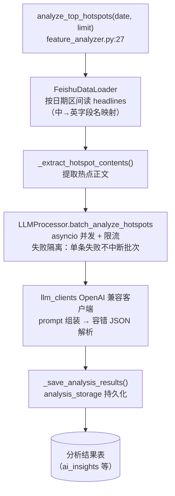
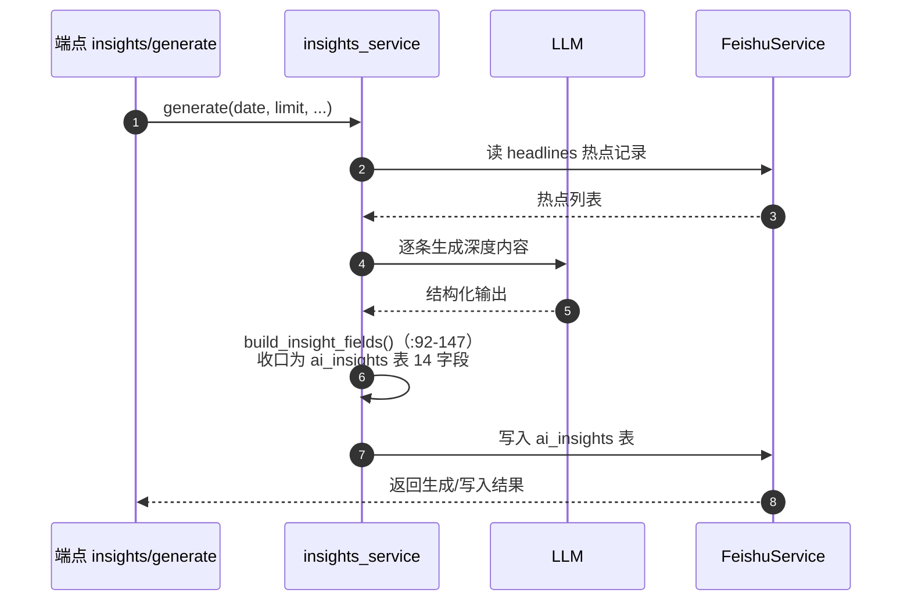
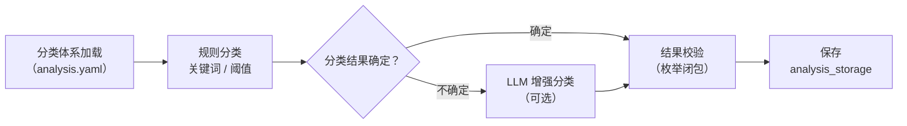

# 08 分析模块（app/services/analysis/）

## 1. 模块结构

```
analysis/
├── analysis_service.py        发布效果分析（collect + report）
├── insights_service.py        ai_insights 深度内容生成（19KB）
├── classification/
│   └── hotspot_classifier.py  热点分类（规则 + LLM 增强）
├── feature_analysis/          热点特征分析包（LLM 批量）
│   ├── __init__.py            包出口
│   ├── feature_analyzer.py    分析主流程
│   ├── feishu_data_loader.py  飞书热点数据加载
│   ├── llm_clients.py         LLM 客户端（抽象 + OpenAI 兼容实现）
│   └── llm_processor.py       并发批处理
└── storage/
    └── analysis_storage.py    分析结果存储（16KB）
```

配置来源：`config/analysis.yaml`（根键 `feature_analysis`），经 `config_manager.get_config()` 读取，**文件缺失时整链路自然退化为空配置**（`config.py:143-161` docstring 明确此契约）。

## 2. 特征分析包 feature_analysis/

### 2.1 FeatureAnalyzer（feature_analyzer.py:13）

热点特征分析主流程入口：

| 方法（行号） | 职责 |
|---|---|
| `__init__()`（`:18`） | 组装 loader + processor + storage |
| `async analyze_top_hotspots(date=None, limit=10)`（`:27`） | **主入口**：加载热点 → 提取内容 → LLM 批量分析 → 保存结果 |
| `async analyze_hotspot_by_id(hotspot_id)`（`:68`） | 单热点（按 id） |
| `async analyze_hotspots_by_date_range(start_date, end_date)`（`:110`） | 日期区间批量 |
| `async _extract_hotspot_contents(hotspots)`（`:146`） / `_extract_single_content(hotspot)`（`:171`） | 正文提取（衔接 ContentFetcher 的产出） |
| `async _save_analysis_results(analysis_results)`（`:210`） | 经 analysis_storage 持久化 |
| `async analyze_single_hotspot(hotspot)`（`:223`） | 内存态单热点分析（不落库） |
| `get_statistics()`（`:246`） | 分析统计 |

`analyze_top_hotspots()` 主流程：



### 2.2 FeishuDataLoader（feishu_data_loader.py）

| 方法（行号） | 职责 |
|---|---|
| `async get_hotspots_by_date_range(start_date, end_date)`（`:65`） | 按日期区间读热点 |
| `async _get_all_records()`（`:104`） | 分页拉全量 headlines |
| `_filter_by_date(records, date)`（`:134`） / `_get_record_date(record)`（`:152`） | 日期过滤 |
| `_get_rank(record)`（`:188`） | 排名排序 |
| `_convert_to_hotspot_format(record)`（`:213`） | 飞书记录 → 标准热点格式（**中→英字段名映射** `_get_english_key :259`） |

### 2.3 llm_clients.py

- **抽象接口**：`generate()` 异步/同步两版（`:35-127`）。
- **OpenAI 兼容客户端实现**：请求构造（messages/model/temperature）、响应解析（容错 JSON 提取）。
- 工厂入口由 `tests/test_llm_client_factory.py` 守护（按 `analysis.yaml` 的 provider 配置实例化）。

### 2.4 LLMProcessor（llm_processor.py:15）

- 初始化 LLM 客户端；
- 单热点分析（prompt 组装 + 解析）；
- `batch_analyze_hotspots`（`:15-133`）：**并发批处理**（asyncio 并发 + 限流），失败隔离（单条失败不中断批次）。

## 3. 深度内容 insights_service.py

| 关键函数（行号） | 职责 |
|---|---|
| `build_insight_fields(...)`（`:92-147`） | **核心转换**：headlines 记录 + LLM 输出 → `ai_insights` 表的 **14 个字段**（写入飞书前的形状收口） |
| preflight 检查逻辑 | 供 `GET /analysis/insights/preflight` 端点调用：配置/表/LLM 可用性前置检查 |
| 生成流程 | 供 `POST /analysis/insights/generate` 端点调用：读 headlines → LLM 生成深度内容 → `build_insight_fields` → 写入 ai_insights 表 |

> 模块内含 `_assert_field_consistency()` 同款 import 期断言（与 limits.py 风格一致），由 `tests/test_insights_mapping.py` 锁字段映射。

insights 生成时序（`POST /analysis/insights/generate`）：



## 4. 热点分类 classification/hotspot_classifier.py

`HotspotClassifier`（`hotspot_classifier.py:10-140`）流程：



## 5. 结果存储 storage/analysis_storage.py

分析结果的持久化层（16KB）：对接飞书表（ai_insights 等），提供写入/更新/查询；字段形状受 `field_rules.TABLE_PLANS` 约束（见 [05-飞书模块](05-飞书模块.md) §3）。

## 6. 发布效果分析 analysis_service.py

`AnalysisService`（`analysis_service.py`）：

- `collect`：回收各平台发布后的效果数据（阅读/互动等）——`POST /api/v1/analysis/collect`。
- `report(platform, publication_id)`：生成效果报告——`GET /api/v1/analysis/report/{platform}/{publication_id}`。

## 7. 调用方与测试

| 调用方 | 端点/任务 |
|---|---|
| HTTP | `/analysis/collect`、`/analysis/report/...`、`/analysis/insights/generate`、`/analysis/insights/preflight` |
| 测试 | `test_feature_analysis_package.py`、`test_llm_client_factory.py`、`test_insights_endpoint.py`、`test_insights_mapping.py`、`test_content_endpoint.py`、`test_content_extractor.py`、`test_content_fetcher.py` |

## 8. 相关文档

- 特征分析设计：`doc/hotspot_feature_analysis_design.md`
- ML 训练：`doc/ml_training_guide.md`
- 配置结构：[11-配置系统](11-配置系统.md)
