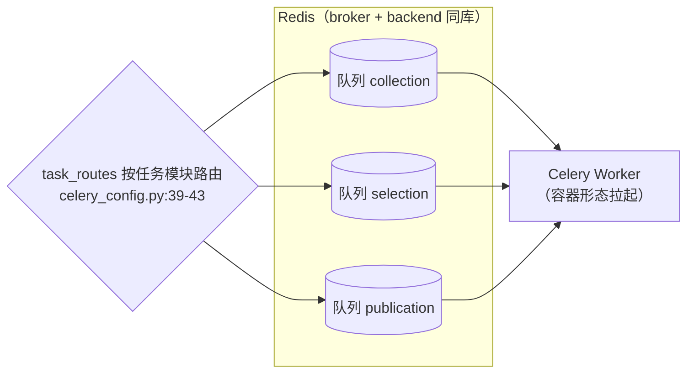
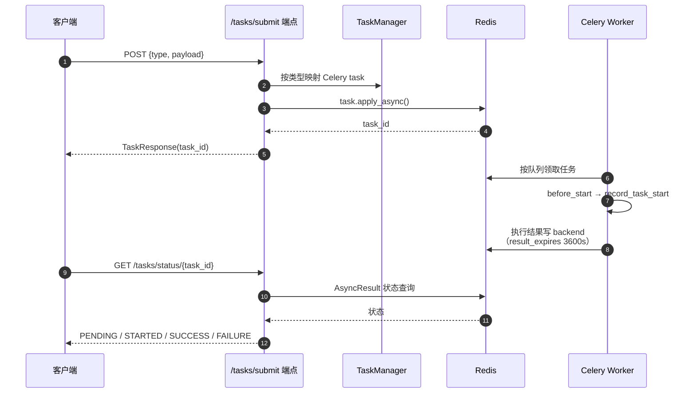

# 09 异步任务（app/tasks/ + app/core/celery_config.py）

## 1. 定位

Celery 异步任务体系**只在容器化形态使用**（生产 cron 批任务不经过这里）。Broker/Backend 均为 Redis（`settings.REDIS_URL`，默认 `redis://localhost:6379/0`），监控用 Flower。

## 2. Celery 应用（app/core/celery_config.py）

```python
celery_app = Celery(
    "intelligent_agent_api",
    broker=settings.REDIS_URL, backend=settings.REDIS_URL,
    include=["app.tasks.collection_tasks",
             "app.tasks.selection_tasks",
             "app.tasks.publication_tasks"])
```

配置要点（针对 2 核 2G 服务器优化，`celery_config.py:24-63`）：

| 配置 | 值 | 说明 |
|---|---|---|
| `task_serializer` / `accept_content` / `result_serializer` | json | 统一 JSON 序列化 |
| `timezone` | Asia/Shanghai | enable_utc=True |
| `task_routes`（`:39-43`） | 见下表 | **三队列隔离** |
| `task_time_limit` / `task_soft_time_limit` | 180s / 150s | 硬/软超时 |
| `worker_prefetch_multiplier` | 1 | 防止单 worker 囤任务 |
| `worker_max_tasks_per_child` | 50 | 子进程定期回收 |
| `worker_max_memory_per_child` | 100000 (KiB) | 子进程内存上限 |
| `result_expires`（`:60`） | 3600s | 结果 1 小时过期 |

队列路由：

| 任务模块 | 队列 |
|---|---|
| `app.tasks.collection_tasks.*` | `collection` |
| `app.tasks.selection_tasks.*` | `selection` |
| `app.tasks.publication_tasks.*` | `publication` |



## 3. 任务基类与注册器（app/tasks/base.py）

### 3.1 BaseTask（`base.py:15`，继承 Celery `Task`）

| 钩子（行号） | 行为 |
|---|---|
| `on_success(retval, task_id, args, kwargs)`（`:22`） | 成功回调：记录 `TaskMetrics`（完成时间、耗时） |
| `on_failure(exc, task_id, args, kwargs, einfo)`（`:37`） | 失败回调：错误指标 + 日志 |
| `on_retry(exc, task_id, args, kwargs, einfo)`（`:53`） | 重试回调 |
| `before_start(task_id, args, kwargs)`（`:61`） | 启动前：`record_task_start`（运行中任务追踪） |

### 3.2 TaskManager（`base.py:74`）

| 方法（行号） | 职责 |
|---|---|
| `register_task(task_name, task_func)`（`:80`） | 注册任务 |
| `get_task(task_name)`（`:84`） | 按名取任务 |
| `list_tasks()`（`:88`） | 任务清单（供 `/tasks/submit` 的类型分发与 `/tasks/metrics`） |

## 4. 三类任务模块

### 4.1 collection_tasks.py

| 任务（行号） | 职责 |
|---|---|
| `batch_collect_websites(...)`（`:16`） | 批量采集：调 `CollectionEngine` 执行并记录结果 |
| `scheduled_collection(...)`（`:67`） | 定时采集（Celery beat 场景） |
| `test_collection_task(self, site_code)`（`:115`） | 采集连通性测试任务 |

### 4.2 selection_tasks.py

| 任务（行号） | 职责 |
|---|---|
| `batch_selection_analysis(...)`（`:16`） | 批量选材：`SelectionEngine.analyze_hotspots()` |
| `platform_specific_selection(...)`（`:61`） | 平台特定选材 |
| `content_strategy_generation(...)`（`:105`） | 内容策略生成 |
| `selection_quality_assessment(...)`（`:150`） | 选材质量评估 |

### 4.3 publication_tasks.py

| 任务（行号） | 职责 |
|---|---|
| `batch_publication(...)`（`:16`） | 批量发布：`PublicationManager` |
| `multi_platform_publication(...)`（`:61`） | 多平台分发 |
| `scheduled_publication(...)`（`:113`） | 定时发布 |
| `publication_status_check(...)`（`:159`） | 发布状态轮询 |
| `test_publication_task(self, platform, test_content)`（`:200`） | 平台连通性测试 |

## 5. Worker 入口（app/tasks/celery_worker.py）

```python
from app.core.celery_config import celery_app
if __name__ == "__main__":
    celery_app.start()
```

（`celery_worker.py:13-18`，先把项目根加入 `sys.path`。）容器形态由 `docker-compose.yml` 的 `apiserver` 服务拉起。

## 6. HTTP 端点（endpoints/tasks.py）

| 端点 | 函数（行号） | 流程 |
|---|---|---|
| `POST /api/v1/tasks/submit` | `submit_task`（`tasks.py:77`） | `TaskSubmitRequest`（type + payload）→ 按类型映射到 Celery task → `apply_async` → 返回 `task_id` |
| `GET /api/v1/tasks/status/{task_id}` | `get_task_status`（`:175`） | `AsyncResult` 状态查询（PENDING/STARTED/SUCCESS/FAILURE） |
| `GET /api/v1/tasks/metrics` | `get_task_metrics`（`:223`） | `TaskMetrics` 汇总（见 [10-通用组件](10-通用组件.md) §metrics） |

任务提交与查询时序：



## 7. 相关文档

- Celery 配置来源 `settings`：[11-配置系统](11-配置系统.md)
- 容器化运行：[12-脚本与运维](12-脚本与运维.md) §Docker
