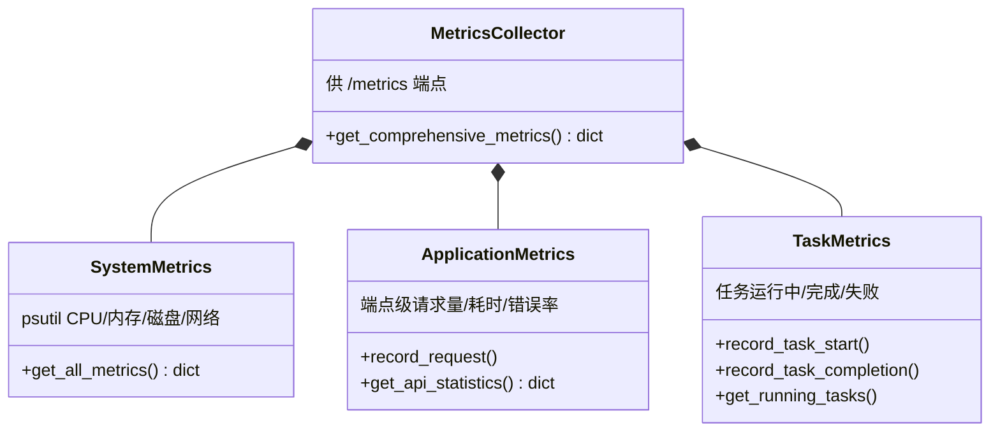

# 10 通用组件（app/utils/ + app/wework/）

## 1. app/utils/ 总览

| 文件 | 核心内容 | 主要使用方 |
|---|---|---|
| `crypto.py` | `CryptoManager`（Fernet 对称加密）、`RequestSigner`（HMAC 请求签名） | 凭据加密、签名中间件（未注册） |
| `feishu_format.py` | `FeishuFormatter` 六个静态格式化方法 | 端点层输出格式化 |
| `hotspot_enrich.py` | 热点增强六函数 | 采集端点 / pipeline |
| `id_generator.py` | `generate_content_id()` | 内容 ID 生成 |
| `logger.py` | loguru 封装的 `logger` | 全局 |
| `metrics.py` | 四个指标类 + `metrics_collector` 单例 | /health、/metrics、任务指标 |
| `yaml_loader.py` | `YamlLoader` 带缓存加载 + 失效 | 配置读取辅助 |

## 2. crypto.py

### 2.1 CryptoManager（`crypto.py:14`）

| 方法（行号） | 职责 |
|---|---|
| `__init__(password=None)`（`:17`） | 派生密钥（无密码走默认 SECRET_KEY） |
| `_create_fernet()`（`:28`） | 构造 Fernet 实例 |
| `encrypt(data) / decrypt(encrypted_data)`（`:40/:49`） | 字符串加解密 |
| `encrypt_dict / decrypt_dict`（`:59/:72`） | dict 值级加解密（保结构） |

### 2.2 RequestSigner（`crypto.py:90`）

| 方法（行号） | 职责 |
|---|---|
| `generate_signature(data, timestamp)`（`:102`） | HMAC 签名生成 |
| `verify_signature(data, timestamp, signature)`（`:119`） | 验签（含时间戳防重放窗口） |
| `sign_request(method, path, body="")`（`:140`） | 组装带签名的请求头 |

> 配套的 `SignatureVerificationMiddleware`（[03-API层](03-API层与中间件.md) §5.2）当前未注册。

## 3. feishu_format.py

`FeishuFormatter`（`feishu_format.py:8`），全部静态方法：

| 方法（行号） | 格式化对象 |
|---|---|
| `format_hotspot_data(hotspot_data)`（`:12`） | 热点数据 → 飞书字段体 |
| `format_selection_results(selection_results)`（`:44`） | 选材结果 |
| `format_content_data(content_data)`（`:140`） | 正文数据 |
| `format_publication_results(publish_results)`（`:209`） | 发布结果 |
| `format_error_message(error_info)`（`:305`） | 错误信息 |
| `format_batch_results(batch_results)`（`:372`） | 批量结果汇总 |

## 4. hotspot_enrich.py

采集结果的**热点增强**（`collection.py` 端点用其产出 `hotspot_id/hot_level/content_quality` 等字段）：

| 函数（行号） | 职责 |
|---|---|
| `calculate_hot_level(hot_value) -> str`（`:43`） | 热度值 → 热度等级 |
| `extract_keywords(title)`（`:61`） | 标题关键词抽取 |
| `categorize_content(title, user_category=None)`（`:74`） | 内容分类 |
| `generate_summary(title, hot_value, rank)`（`:86`） | 摘要生成 |
| `assess_content_quality(title, hot_value) -> dict`（`:94`） | 内容质量评估 |
| `parse_hot_value(hot_str)`（`:115`） | 热度字符串解析（"1.2万" → 数值） |

## 5. id_generator.py

```python
def generate_content_id():   # id_generator.py:13
```

内容 ID 生成（UUID 族）。⚠️ `secret/generate_auth_key.py:60` 有一份**重复实现**（README §九-4 已登记）。

## 6. logger.py

基于 **loguru** 的统一 `logger` 单例（`logger.py`），全仓 `from app.utils.logger import logger`。级别由 `settings.LOG_LEVEL`（默认 INFO）控制。

## 7. metrics.py

| 类（行号） | 职责 |
|---|---|
| `SystemMetrics`（`:13`） | psutil 采集 CPU/内存/磁盘/网络/uptime（`get_all_metrics :74`） |
| `ApplicationMetrics`（`:87`） | 端点级请求量/耗时/错误率（`record_request :99`、`get_api_statistics :157`） |
| `TaskMetrics`（`:182`） | 任务运行中/完成/失败指标（`record_task_start :190`、`record_task_completion :212`、`get_running_tasks :256`） |
| `MetricsCollector`（`:270`） | 聚合门面：`get_comprehensive_metrics()`（`:278`）供 `/metrics`；全局单例 `metrics_collector` |

数据为**进程内存态**（非 Prometheus exposition），`prometheus_client` 在依赖中备用。

四个指标类与聚合门面的组合关系（`metrics_collector` 为全局单例）：



## 8. yaml_loader.py

| 类/函数（行号） | 职责 |
|---|---|
| `YamlLoader.load(file_path)`（`:24`） | 安全加载（`yaml.safe_load`）+ **mtime 缓存** |
| `YamlLoader.invalidate(file_path)`（`:48`） / `clear_cache()`（`:55`） | 缓存失效 |
| `load_yaml_config(file_path)`（`:61`） | 便捷函数 |

> 与 `config.py` 的 `ConfigManager` 的关系：ConfigManager 自带 mtime 热重载（[11-配置系统](11-配置系统.md)），`YamlLoader` 是独立的通用带缓存加载器。

## 9. app/wework/（企业微信通知）

| 文件 | 函数（行号） | 职责 |
|---|---|---|
| `notification_push.py` | `get_webhook_url()`（`:8`） | 从 credentials 读企微 webhook |
| | `send_message(message)`（`:25`） | 同步发文本消息（requests POST） |
| | `send_message_async(message)`（`:47`） | 异步版 |
| `file_push.py` | `send_file_message(file_path)`（`:25`） | 发文件（先传素材拿 media_id） |
| | `send_file_message_with_media_id(webhook_url, media_id)`（`:62`） | 按 media_id 发文件 |
| | `send_text_message(message)`（`:88`） | 发文本 |

**使用方**：`everday_task.py`（每步流程通知）、`collection_pipeline.py`（站点缺口告警 `:113-120`、容量告警）、`cookie_store.notify()`（cookie 更新通知）。
