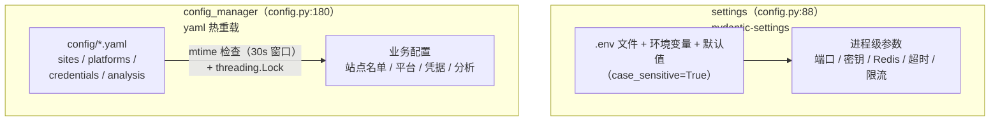
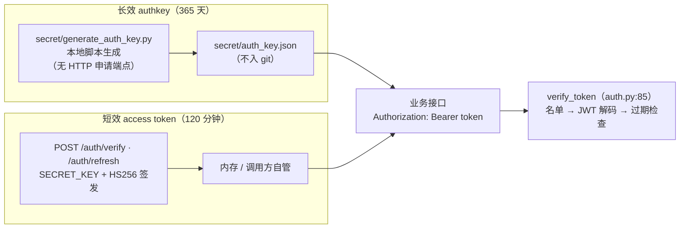

# 11 配置系统

## 1. 双实例架构

## 2. Settings（config.py:15，BaseSettings）

| 分组 | 配置项（默认值） |
|---|---|
| 基础 | `APP_NAME`("智能体工作流API服务")、`DEBUG`(False)、`HOST`("0.0.0.0")、`PORT`(8000)、`WORKERS`(2) |
| 路径 | `BASE_DIR`(app/)、`CONFIG_DIR`(../config)、`SITES_CONFIG_FILE`、`PLATFORMS_CONFIG_FILE`、`CREDENTIALS_CONFIG_FILE`、`ANALYSIS_CONFIG_FILE` |
| 安全 | `SECRET_KEY`、`ALGORITHM`(HS256)、`ACCESS_TOKEN_EXPIRE_MINUTES`(120) |
| CORS | `ALLOWED_ORIGINS`(["*"]) |
| 限流 | `RATE_LIMIT_PER_MINUTE`(60)、`RATE_LIMIT_PER_HOUR`(1000) |
| 采集 | `COLLECTION_TIMEOUT`(10)、`COLLECTION_MAX_RETRIES`(3) |
| 发布 | `PUBLICATION_TIMEOUT`(15)、`PUBLICATION_MAX_RETRIES`(3) |
| Redis | `REDIS_URL`(redis://localhost:6379/0)、`REDIS_PASSWORD`、`REDIS_MAX_CONNECTIONS`(10)、`REDIS_MAX_MEMORY`(256mb)、`REDIS_MAX_MEMORY_POLICY`(allkeys-lru) |
| Celery | `CELERY_BROKER_URL`、`CELERY_RESULT_BACKEND`、`CELERY_TASK_SERIALIZER`(json)、`CELERY_ACCEPT_CONTENT` |
| 异步任务 | `ASYNC_TASK_TIMEOUT`(300)、`ASYNC_TASK_RETRY_COUNT`(3)、`ASYNC_TASK_RETRY_DELAY`(60) |
| 日志 | `LOG_LEVEL`(INFO)、`LOG_FILE` |
| 热重载 | `CONFIG_RELOAD_INTERVAL`(30) |

加载规则：`env_file=".env"`、`case_sensitive=True`（`config.py:82-84`）。`.env` 模板见根目录 `.env.example`。

## 3. ConfigManager（config.py:91）——yaml 热重载

| 方法（行号） | 读取文件 | 根键 |
|---|---|---|
| `get_sites_config(force_reload=False)`（`:118`） | `config/sites.yaml` | `sites`（`enabled` 名单**真正决定采集名单**） |
| `get_platforms_config()`（`:126`） | `config/platforms.yaml` | 平台定义 |
| `get_credentials()`（`:134`） | `config/credentials.yaml` | 飞书 app_id/secret、企微 webhook、各平台密钥 |
| `get_config()`（`:143`） | `config/analysis.yaml` | `feature_analysis`（调用方 `.get('feature_analysis', {})` 兜底，缺失自然退化） |

热重载机制：`_should_reload()`（`:163`）按文件 **mtime** 判断，30 秒窗口；全部方法加 `threading.Lock`。文件不存在返回 `{}`（`_credentials_config` 显式初始化为 None 的坑已在 `:97-100` 注释登记）。

## 4. config/ 文件清单

| 文件 | 是否入 git | 结构要点 |
|---|---|---|
| `sites.yaml` | ✅ | 根键 `sites`：每站点 `enabled` / 采集参数 / selector；**enabled=true 名单是采集站点的单一事实来源**（`test_target_sites_source_of_truth.py` 锁） |
| `platforms.yaml` | ✅ | 6 个发布平台的定义：字段映射、内容偏好、`scoring_weights`（选材权重覆盖）、插件 |
| `analysis.yaml` | ✅ | 根键 `feature_analysis`：LLM provider/model/并发、分类体系、insights 参数 |
| `redis.conf` | ✅ | 容器形态 Redis 配置（maxmemory 等与 Settings 对齐） |
| `credentials.yaml` | ❌ gitignore | **真实生产密钥**，不得提交；结构参考 `credentials.yaml.example` |
| `zhihu.yaml` | ❌ gitignore | 知乎 cookie/token；⚠️ 代码读**硬编码绝对路径** `/root/apiserver/config/zhihu.yaml`（`zhihu.py:43`，嵌套键 `collection.result_limit` 可覆盖上限） |
| `xiaohongshu.yaml` | ❌ gitignore | 小红书采集配置；参考 `xiaohongshu.yaml.example` |

> 新增配置只动对应的 `*.example`，真实文件不入库。

## 5. 令牌与凭据体系

### 5.1 两套令牌（并存勿混）

| 机制 | 生成/签发 | 有效期 | 存储 |
|---|---|---|---|
| 长效 authkey | `secret/generate_auth_key.py`（本地脚本，**没有 HTTP 申请端点**） | 365 天 | `secret/auth_key.json`（不入 git） |
| 短效 access token | `POST /api/v1/auth/verify`、`/refresh`（`settings.SECRET_KEY` HS256） | 120 分钟 | 内存/调用方自管 |

业务接口统一 `Authorization: Bearer <token>`，由 `verify_token`（`auth.py:85`）校验。

两套令牌的来源与使用路径（校验时序详见 [03-API层](03-API层与中间件.md) §3）：

### 5.2 凭据加密

`CryptoManager`（Fernet，[10-通用组件](10-通用组件.md) §2）可对 dict 值加密后落盘。

## 6. 环境变量速查

| 变量 | 作用 | 出处 |
|---|---|---|
| `APISERVER_ALLOW_MOCK=1` | 显式开启 mock 回退（默认关） | `mock_utils.py:41` |
| `APISERVER_HOME` | 生产脚本定位项目根 | `run_daily_task.sh:12-25` |
| `.env` 全部键 | Settings 覆盖（见 §2） | `config.py:83` |

## 7. 相关文档

- 设计文档：`doc/开发设计.md`、`doc/需求prd.md`
- 飞书令牌获取：`doc/飞书用户访问令牌获取指南.md`
- 安全说明：`doc/SECURITY.md`
