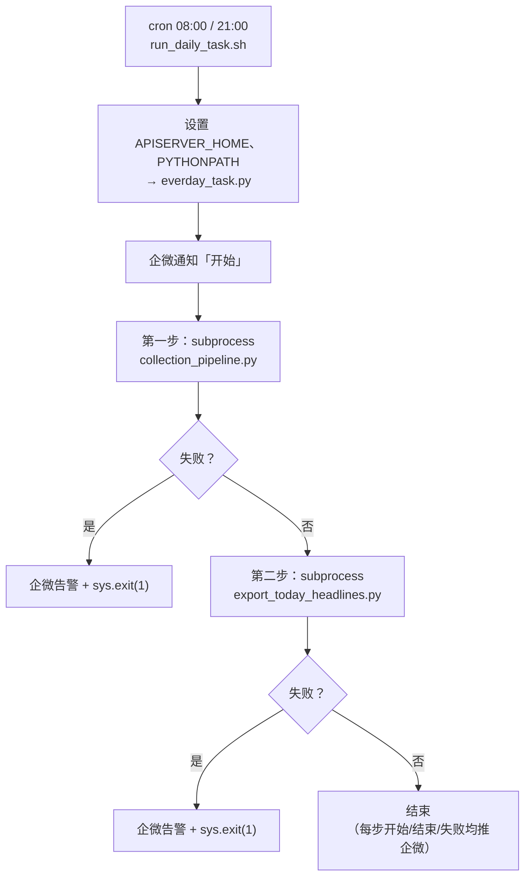
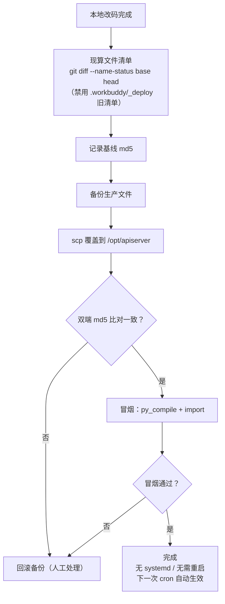

# 12 脚本与运维

## 1. script/ 总览：生产调度 vs 人工入口

**生产只有 3 条 cron**（唯一调度，仓库内无 systemd unit）：

| 时间 | 脚本 | 作用 |
|---|---|---|
| `0 8 * * *` | `script/run_daily_task.sh` | 采集 + 导出当日归档 |
| `0 21 * * *` | `script/run_daily_task.sh` | 采集 + 导出当日归档 |
| `0 2 * * *` | `script/scheduled_cleanup.sh` | 飞书表清理（时间 + 容量两级） |

其余脚本均为**人工**入口，不在调度内。

## 2. 主链路脚本详解

### 2.1 run_daily_task.sh（cron 入口，`run_daily_task.sh:12-25`）

设置 `APISERVER_HOME`、`PYTHONPATH` 后调 `script/everday_task.py`。

### 2.2 everday_task.py（编排器）

流程（`everday_task.py:46-76`）：



`run_script()`（`:15`）封装 subprocess（check=True + capture_output，失败打印返回码/stdout/stderr）。

### 2.3 collection_pipeline.py（采集→入库主管道）

核心流程（行号摘录）：

| 步骤 | 位置 | 内容 |
|---|---|---|
| ① 初始化 | `:52-80` | `CollectionEngine` + `SelectionEngine` + `FeishuService`，按 `format="feishu"` 采集 |
| ② 站点缺口告警 | `:113-120` | 对「已启用但本次 0 产出」的站点推企微并打印（**自认不判因**） |
| ③ 构造写集 | `:122-166` | 读 `credentials.yaml` 飞书表配置；`split_write_set`（`:149`）拆分 mock/真实；同步表字段（`ensure_table_fields`） |
| ④ 容量预检 | `:290-314` | **`ensure_capacity`（`:298`）**：不足则删旧记录 + 容量告警 |
| ⑤ 写入 | `:298` 后 | `batch_add_records()` 按 title upsert（只与**当天**记录比对，跨天重复是设计语义） |

> ⚠️ `ensure_capacity` 预检**只有这一处**；另两个写入面（enhanced 端点 / feishu sync 端点）没有，兜底是 `batch_add_records` 内部 1254103 自愈（[05-飞书模块](05-飞书模块.md) §2.3）。

### 2.4 export_today_headlines.py（当日归档）

`:59-131`：从飞书拉当日 headlines → 导出 `<项目根>/{date}_headlines_data.json`（落点已修正为**项目根目录、不依赖 cwd**）。

### 2.5 scheduled_cleanup.sh + cleanup_feishu_data.py（清理）

- cron 02:00（`scheduled_cleanup.sh:4-15`）。
- `cleanup_feishu_data.py` 两级策略：① 按时间删 `RETENTION_DAYS`(25) 天前；② 仍高于 `WATERMARK`(17,000) 则**最旧优先**删到水位内（比 25 天新的也照删，见 [02-整体架构](02-整体架构.md) §3.2 第 3 条）。
- 天数取值必须来自 `limits.py`，不得写死（历史教训：两处数字漂移）。

## 3. 其余人工脚本

| 脚本 | 用途 |
|---|---|
| `api_pipeline.py` | 手动重放整条 HTTP 链路（采集→选材→发布） |
| `verify_run.sh` | 带副作用的运行验证（会真实写表，谨慎） |
| `smart_cleanup.py` | 旧版智能清理（阈值 80k/95k/100k 已废弃，以 limits.py 为准） |
| `manage_history_data.py` | 归档搬移到 `history_data/`（**不在任何调度里**，需人工执行） |
| `analyze_history_data.py` | 历史数据分析 |
| `export_headlines.py` / `export_all_headlines.py` | 按日/全量导出 |
| `fetch_content_backfill.py` | 正文批量回填 |
| `deduplicate_collect.py` | 去重采集 |
| `zhihu_cookie_tool.py` | 知乎 cookie 人工刷新（配合 `cookie_store.write_cookie_auth`） |
| `start.sh` | 本地启动辅助 |

## 4. 生产部署

| 项 | 现状 |
|---|---|
| 生产机 | 内网主机（openEuler 24.03 / Python 3.11.6，IP 与 SSH 端口以运维配置为准） |
| 代码路径 | `/opt/apiserver`（`/root/apiserver` 是软链，兼容 zhihu.py 等硬编码） |
| 发布方式 | **scp 直传 + md5 比对**：记录基线 → 备份 → 覆盖 → 双端校验 → 冒烟（py_compile + import） |
| ⚠️ 禁止 | **不要在生产 `git pull`**（生产 git 历史与本地不同、工作区有未提交改动） |
| 文件清单 | **必须现算** `git diff --name-status <base> <head>`；`.workbuddy/_deploy/` 有三份互相冲突的旧清单（10/43/4 文件），沿用会**静默少发文件**（gitignored，不在仓库） |
| 重启 | 生产无 systemd 服务，改代码**无需重启**，下一次 cron 即生效 |

scp 部署流程（含校验与回退分支）：



> ⚠️ 全程**禁止生产 `git pull`**（生产 git 历史与本地不同）。

运维细节：`doc/DEPLOY.md`、`doc/DEPLOYMENT.md`、`doc/服务器优化指南.md`。

## 5. 容器化形态（与生产形态不同，勿混用）

### 5.1 docker-compose.yml（4 服务）

| 服务 | 说明 |
|---|---|
| `apiserver` | FastAPI + Celery worker（`Dockerfile` 构建） |
| `redis` | broker/backend（挂 `config/redis.conf`） |
| `mongodb` | 备用存储 |
| `playwright` | 浏览器容器（weibo 等站点采集） |

### 5.2 deploy.sh

部署 + 健康检查。历史缺陷：曾检查 compose 里**不存在**的 `api` / `celery-worker` 服务名（健康检查永不通过）；已修（`2947c84`：改为 `apiserver` 并删除永不成立的 worker 检查块），由 `tests/test_deploy_service_names.py` 持续守护。

### 5.3 启动

```bash
docker compose up -d          # 4 服务
python app/tasks/celery_worker.py   # 或单独拉 worker
```

## 6. debug/ 与根目录脚本

| 脚本 | 用途 |
|---|---|
| `debug/debug_thepaper_collection.py` 等 | 各站点采集调试（debug_zhihu / debug_auth / debug_matching / debug_site_code / debug_xiaohongshu_page …） |
| `secret/generate_auth_key.py` | 生成长效 authkey（365 天）→ `secret/auth_key.json`（含 `generate_content_id` 重复实现） |
| `train_content_matching_model.py`（根目录） | ML 选材模型训练（jieba + sklearn → content_matching_model.pkl；**未部署生产**） |
| `parse_xiaohongshu_mcp.py`（根目录） | 小红书 MCP 输出解析工具 |
| `run_tests.py`（根目录） | 测试辅助入口 |
| `doc/generate_random_key.py` | 密钥生成 |

## 7. 故障排查速查

| 症状 | 首查 |
|---|---|
| 某站点 0 产出 | 企微缺口告警文案（不判因）→ 手动 `debug/debug_<site>.py`；zhihu 先查 cookie（`zhihu_cookie_tool.py`） |
| 飞书写入失败 1254103 | `ensure_capacity` 是否执行；表内计数 vs WATERMARK |
| weibo 报 "Executable doesn't exist" | `playwright install chromium` 未执行 |
| 单轮量异常 | `site_caps.py` import 是否报错（G1/G2 守卫 fail-loud）；`tests/test_site_caps_budget.py` |
| 容器健康检查失败 | 服务名是否为 `apiserver`（`test_deploy_service_names.py`） |
