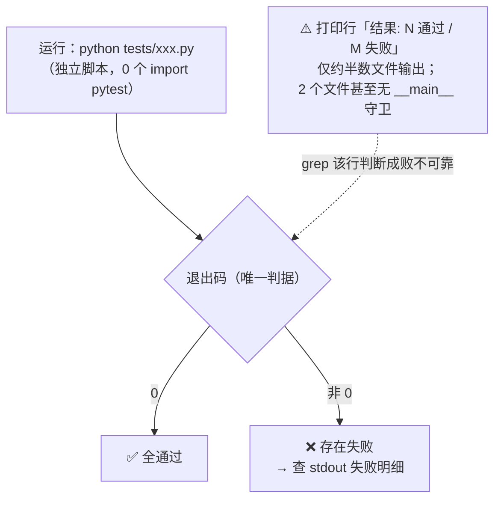
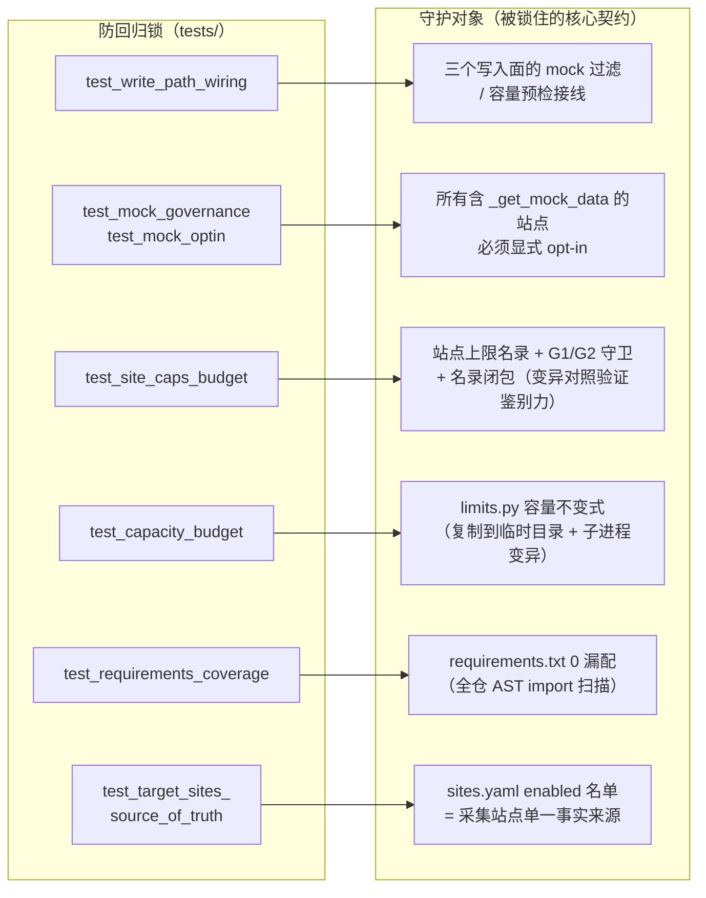

# 13 测试体系（tests/）

## 1. 运行方式（重要约定）

`tests/` 下每个文件都是**独立可执行脚本**，**不使用 pytest**（0 个 `import pytest`）：

```bash
python tests/<name>.py        # 退出码 0 = 全通过
```

> **判据一律以退出码为准**：末行打印「结果: N 通过 / M 失败」的只有约半数文件；`test_llm_client_factory.py` 与 `test_publication_platforms.py` 甚至没有 `__main__` 守卫（靠模块级顺序执行 + 末尾 `sys.exit`）。不要靠 grep 结果行判断成败。



**本机（Windows）注意事项**：bash coreutils 不可用，用绝对路径调用解释器；依赖未装时用「依赖桩 + 直接加载真实源码」方式，**不要为跑测试装全量依赖**。

## 2. 测试清单（本 Wiki 生成时清点 24 个；README §七 记 22 为其编写时点数）

### 2.1 防回归锁（关键七套，README §七）

| 测试 | 锁住什么 |
|---|---|
| `test_write_path_wiring.py` | 三个写入面的 mock 过滤 / 容量预检**接线**是否还在（模块在、行为被改回去 ⇒ 变红） |
| `test_mock_governance.py` / `test_mock_optin.py` | 动态枚举所有含 `_get_mock_data` 的站点；mock 必须显式 opt-in（`APISERVER_ALLOW_MOCK`） |
| `test_site_caps_budget.py` | 站点上限名录 + G1/G2 守卫 + 名录闭包 + 接线锁（**用变异对照证明有鉴别力**） |
| `test_capacity_budget.py` | `limits.py` 容量不变式；用「复制到临时目录 + 子进程 import」做文本变异（这也是 limits.py 必须零 import 的原因） |
| `test_requirements_coverage.py` | 全仓 AST import 扫描 vs `requirements.txt`，0 漏配 |
| `test_thepaper_collection.py` / `test_thepaper_feishu_shape.py` | thepaper 采集行为与飞书写入形状 |
| `test_target_sites_source_of_truth.py` | `sites.yaml` enabled 名单的单一事实来源 |



### 2.2 其余测试

| 测试 | 覆盖 |
|---|---|
| `test_zhihu_cookie_refresh.py` | 知乎 cookie 刷新链路（`cookie_store.write_cookie_auth` 的原子写/回读校验红线） |
| `test_write_path_observability.py` | 写入路径可观测性 |
| `test_feishu_field_plans.py` | 字段规划（`field_rules.py`） |
| `test_deploy_service_names.py` | `deploy.sh` 检查的服务名与 compose 实际一致（历史缺陷回归锁） |
| `test_export_archive_path.py` | 导出落点为项目根、不依赖 cwd |
| `test_cctv_collection.py` | 央视采集 |
| `test_publication_platforms.py` | 发布平台（`platforms/`） |
| `test_feishu_capacity.py` | 飞书容量行为（`is_safe/describe` 等） |
| `test_llm_client_factory.py` | LLM 客户端工厂 |
| `test_feature_analysis_package.py` | feature_analysis 包 |
| `test_insights_mapping.py` / `test_insights_endpoint.py` | insights 字段映射与端点 |
| `test_content_endpoint.py` / `test_content_extractor.py` / `test_content_fetcher.py` | 正文端点 / 提取器 / 抓取器 |

## 3. 辅助入口

根目录 `run_tests.py`：批量运行辅助（按退出码汇总）。

## 4. 写新测试的建议

1. 保持**独立脚本**风格：`if __name__ == "__main__"` + 退出码，不引入 pytest 依赖。
2. 改容量相关常量（`limits.py` / `site_caps.py`）前先跑 `test_capacity_budget.py` + `test_site_caps_budget.py`——import 期守卫会让错误当场暴露。
3. 改写入面（pipeline / enhanced / feishu sync）后必跑 `test_write_path_wiring.py` + `test_write_path_observability.py`。
4. 有副作用的验证用 `script/verify_run.sh`（人工、会真实写表），不要塞进 tests/。
