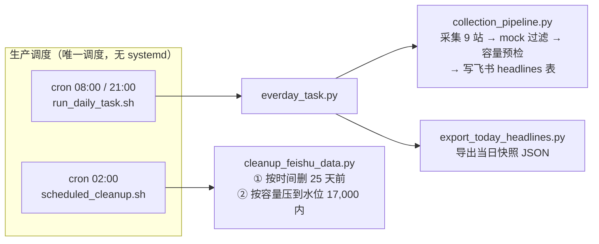

# apiserver Code Wiki

> **热点采集 → 飞书多维表格 → 内容选材 → 多平台发布** 的自动化管道。
> 本 Wiki 基于仓库基线提交 `c3d05ae` 生成；所有 `file:line` 引用均以该版本代码为准。
> 如发现文档与代码不符，**以代码为准**，并提交修正。

## 文档地图

| # | 文档 | 内容 |
|---|---|---|
| 01 | [项目概览](01-项目概览.md) | 项目定位、技术栈、目录结构、术语表 |
| 02 | [整体架构](02-整体架构.md) | 分层架构、核心数据流、容量模型与守卫、三种运行形态、模块依赖 |
| 03 | [API 层与中间件](03-API层与中间件.md) | main.py、路由注册、全部 HTTP 端点明细、认证机制、4+2 中间件 |
| 04 | [采集模块](04-采集模块.md) | 采集引擎、9 站点实现、容量守卫、mock 治理、正文抓取、cookie 存储 |
| 05 | [飞书模块](05-飞书模块.md) | FeishuService 全方法、字段规划、容量常量、批写自愈机制 |
| 06 | [选材模块](06-选材模块.md) | 规则选材引擎（五维打分）、ML 选材引擎 |
| 07 | [发布模块](07-发布模块.md) | 发布管理器、平台工厂、6 平台实现 |
| 08 | [分析模块](08-分析模块.md) | 特征分析（LLM）、深度内容 insights、热点分类、结果存储 |
| 09 | [异步任务](09-异步任务.md) | Celery 配置、任务基类、三类任务、任务端点 |
| 10 | [通用组件](10-通用组件.md) | utils/（加密/格式化/指标/日志等）、wework/ 企微通知 |
| 11 | [配置系统](11-配置系统.md) | Settings、ConfigManager 热重载、yaml 结构、凭据与令牌 |
| 12 | [脚本与运维](12-脚本与运维.md) | script/ 全部入口、生产部署、Docker 形态、调试脚本 |
| 13 | [测试体系](13-测试体系.md) | 22 个独立测试脚本、防回归锁、运行方式 |

## 按角色阅读路径

- **新成员上手**：01 → 02 → 03（接口面）→ 12（怎么跑起来）
- **改采集 / 加站点**：02（容量模型必读）→ 04 → 05 → 13（test_site_caps_budget.py 是硬约束）
- **改选材 / 发布**：06 → 07 → 11（platforms.yaml / credentials.yaml）
- **运维 / 排障**：12 → 02 §容量模型 → 13（verify_run.sh 有副作用，先读 12）
- **做深度内容 / LLM 分析**：08 → 11（analysis.yaml）

## 全局速览

- 生产环境：openEuler 24.03 / Python 3.11.6 / `/opt/apiserver`，**唯一调度是 3 条 cron**，无 systemd。
- 仓库另有 FastAPI 常驻服务（`app/main.py`）与容器化形态（`Dockerfile` / `docker-compose.yml`），与生产 cron 形态并存、**不混用**。
- 核心外部依赖：飞书多维表格（数据底座）、企业微信 webhook（告警通知）、LLM（特征分析）、Redis（仅 Celery/容器形态使用）。
