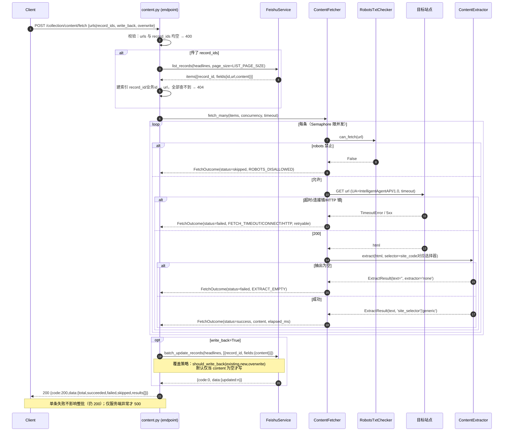
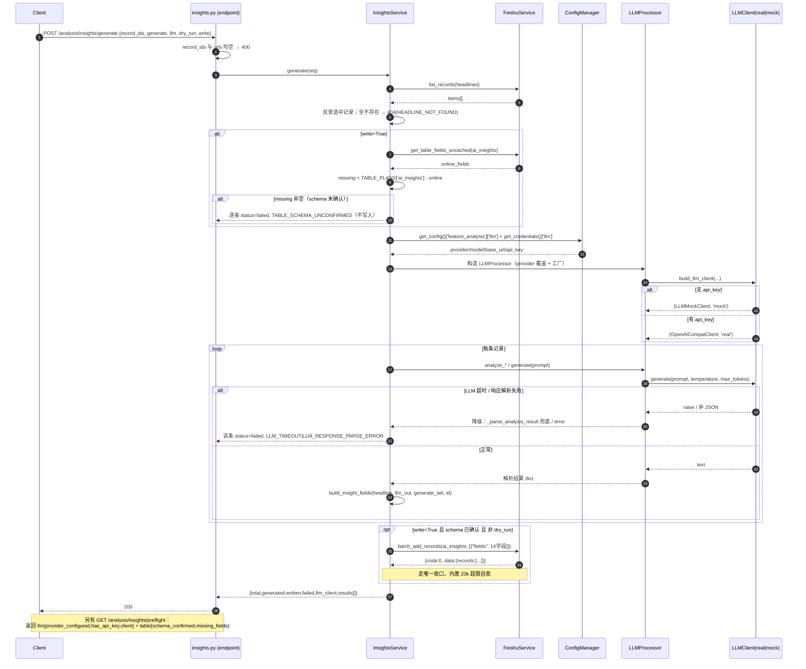
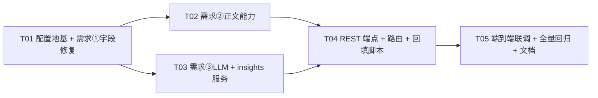

# 增量架构设计 + 任务分解：字段补齐 + 正文采集 + ai_insights 写入

> 输入：`doc/incremental/incremental-prd.md`（PM 交付）
> 系统：已上线运行的生产后端 `apiserver`（Python 3.9.19 + FastAPI + lark_oapi + 飞书多维表格）
> 性质：**增量最小变更**，不重构既有稳定逻辑
> 本文档覆盖 PRD 的 3 项增量需求，并输出**可直接照做**的有序任务清单。

---

## 0. 已核实的既有事实（设计前提，不再重复考古）

| 编号 | 事实 | 对本设计的影响 |
|---|---|---|
| F1 | **活路由表是 `app/api/v1/api.py`**（`app/main.py:12` 导入它）。`app/api/v1/__init__.py` 里另有一份 `api_router` 是**死副本**（无入口导入，且 `enhanced_collection` 前缀不同：活的是 `/enhanced`）。 | 新端点**只能**注册进 `app/api/v1/api.py`。 |
| F2 | 鉴权依赖 `app/api/v1/endpoints/auth.py:85`：`verify_token(credentials=Depends(security))`。全项目写法 `payload: dict = Depends(verify_token)`。`dependencies.py` 里没有鉴权函数。 | 新端点统一复用 `verify_token`。 |
| F3 | `feishu_service` **没有**记录更新能力（13 个 async 方法里无 update）。`list_records` 返回 `result["data"]`，`items[*]` 含 `record_id`/`fields`。 | 需求②回写**必须新增** `batch_update_records()`。 |
| F4 | `ConfigManager` **缺 `get_config()`**，而 `analysis/` 下有 4 个文件调用它读 `['feature_analysis'][...]` 的不同子段 → 整个 `analysis/` 模块**实例化即 `AttributeError`**。 | 需求③的拦路虎；必须新增 `get_config()`。 |
| F5 | `LLMProcessor._initialize_llm_client()` **无条件返回 `LLMMockClient`**；`LLMMockClient` 仅被 `llm_processor.py` 内部引用（全仓无外部 import）。 | 新增真实客户端需与 Mock **同签名**，并把 Mock 迁到独立模块以便共享。 |
| F6 | 需求①的两个字段 `published_at`(第23行)/`error_message`(第31行) **已在 `BASE_FIELD_DEFINITIONS`**，缺的是 `TABLE_PLANS` 显式名单。`_resolve_fields()` 只校验"显式名单里的名字是否已定义"。 | 改动是**纯新增名单项**，不触发 import 期 `ValueError`。 |
| F7 | **9 个采集站点全部已在 `fields` 里 emit `published_at`**（zhihu/cctv/thepaper/xinhua/people_daily/tech_36kr/weibo/baidu/xiaohongshu）。生产 cron `script/collection_pipeline.py` 直接 `feishu_records.extend(result["news"])`，即**已携带 `published_at`**。 | 需求①的落库率提到达标靠"名单补入"即可，**无需改 9 个站点**；唯一例外见下。 |
| F8 | `app/api/v1/endpoints/enhanced_collection.py:125-139` 手动构造的 headlines `feishu_record` 只有 **11 个键，未含 `published_at`**；`tests/test_feishu_field_plans.py [3]` 断言 `plan_hl ∈ writer_sets`（该 writer 集合即此 dict）。 | 补名单后**必须同步**给该 dict 加 `published_at`，否则既有测试 [3] 失败。 |
| F9 | `tests/test_feishu_field_plans.py [4]` 用 `FROZEN` 冻结各表字段数：`headlines=11`、`publish_tasks=13`。 | 补名单后字段数变 12/14，**必须同步更新 `FROZEN`**（否则 207 断言中至少 2 条失败）。 |
| F10 | `manager.py:119` 仅 `if result['success']` 才调用 `_store_publish_result_to_feishu`；而函数体第 162 行**已经**会写 `error_message`。 | R1-4 只需把调用改为"总是调用"，函数体不用改。 |

---

## 1. 实现方案总览

### 需求 ① 字段缺口修复

**做法**：
1. `field_rules.py` 的 `TABLE_PLANS['headlines']` 显式名单加入 `'published_at'`；`TABLE_PLANS['publish_tasks']` 加入 `'error_message'`。**不动 `BASE_FIELD_DEFINITIONS`**（F6）。
2. 同步 `enhanced_collection.py` 的 headlines `feishu_record` 补 `published_at` 键（F8）。
3. `zhihu.py:144` 删除冗余 `"platform": "zhihu"`；`headlines` 名单**不**补 `platform`。
4. `manager.py:119` 改为**总是**调用 `_store_publish_result_to_feishu`（F10），失败时落 `error_message`。

**为什么这样做 / 为什么不做另一种**：
- **不补 `platform`**：与 `site_code` 语义重复，仅 1 个站点写；补进名单反而制造"跨表污染"（历史缺陷 8 根因）。改为在写入侧清理冗余键。
- **不改 9 个站点**：站点已 emit `published_at`（F7），0% 落库率的根因是"名单缺失 → `_align_records_with_fields` 把它当多余字段丢弃"，不是采集器没采。**最小变更 = 只改名单**。
- **绝不改回关键词匹配**：`TABLE_PLANS` 已全部冻结为显式名单，`_resolve_fields()` 有 import 期守卫。

**关键前提（写进验收）**：`headlines` 字段数 11→12、`publish_tasks` 13→14，必须同步更新 `tests/test_feishu_field_plans.py` 的 `FROZEN`，否则既有 207 断言失败。这是**有意的**字段集扩展，非"破坏测试"。

---

### 需求 ② 正文采集能力

**做法**：拆成三层，**I/O 与纯逻辑分离**（离线可测的硬要求）：
1. **纯逻辑层** `content_extractor.py`：`HTML → 正文文本`。仅用 stdlib `html.parser`，零第三方依赖。按"站点选择器优先，通用兜底"抽取。
2. **服务层** `content_fetcher.py`：编排"robots 检查 → HTTP 抓取 → 抽取 → 覆盖策略判定"，注入 `http_getter`/`robots`/`extractor`，并发用 `asyncio.Semaphore`。回写调用 `feishu_service.batch_update_records()`。
3. **接入层** `endpoints/content.py`：`POST /collection/content/fetch`（P0）+ `POST /collection/content/backfill`（P1）。+ `script/fetch_content_backfill.py`（P1 离线脚本）。

**为什么这样做 / 为什么不做另一种**：
- **不并入 08:00/21:00 主 cron**：主流水线已稳定（20k 上限、500/批分片、超限自愈、upsert）。加重活会使其变慢变脆。改按需端点 + 可选脚本（PRD §3 取舍）。
- **回写走 update 而非 add**：`batch_add_records` 是"新增"语义，回写会产生重复行。新增 `batch_update_records()`（F3）。请求体是**对象数组** `{"records":[{"record_id","fields"}]}`——与 `batch_add_records`（无 record_id）、`batch_delete`（纯字符串数组）三者形状都不同，**代码注释必须写清**（本项目已因混淆 `batch_delete` 形状踩过坑）。
- **纯逻辑抽出**：本机无 `aiohttp/httpx`（离线），正文抽取/选择器匹配/URL→站点推断/覆盖策略判定必须是**不联网、不装依赖**就能测的纯函数，供"依赖桩 + 断言计数器"风格测试。
- **不引入 `bs4/lxml`**：目标机可能未装且违反最小变更。用 stdlib `html.parser` 实现"标签名 + class + id"的**最小选择器**（覆盖 `div.article-content` / `#content` / `article` 等常见形态），足以满足"按站点选择器 + 通用兜底"。

**合规**：只抓 headlines 里已记录的 URL；User-Agent 明确标识（`IntelligentAgentAPI/1.0`，复用 `robots_checker` 既有标识）；遵守 `robots.txt`；不递归爬站；并发默认 4、硬上限 8。

---

### 需求 ③ ai_insights 深度内容写入

**做法**：三块拼装：
1. **配置地基（F4）**：给 `ConfigManager` 新增 `get_config()`，读**新增的** `config/analysis.yaml`（根键 `feature_analysis`）。`Settings` 加 `ANALYSIS_CONFIG_FILE`。文件缺失返回 `{}` → 4 个既有调用方（`llm_processor/feishu_data_loader/hotspot_classifier/analysis_storage`）**零改动**，能退化。
2. **LLM 可插拔（F5）**：新 `llm_clients.py` 定义 `BaseLLMClient` + `OpenAICompatClient`（httpx，OpenAI 兼容）+ `build_llm_client()` 工厂；`LLMMockClient` 迁入该模块（唯一引用点就在 `llm_processor`，迁移安全）。`LLMProcessor._initialize_llm_client()` 改为调用工厂并按 Key 有无选择 real/mock。
3. **映射 + 写入**：新 `insights_service.py`：从 headlines 读记录 → 调 LLM → 纯函数 `build_insight_fields()` 映射 14 字段 → `feishu_service.batch_add_records()` 写 `ai_insights`。新 `endpoints/insights.py`：`POST /analysis/insights/generate` + `GET /analysis/insights/preflight`。

**为什么这样做 / 为什么不做另一种**：
- **补 `get_config()` 而非改 4 个调用方**：改 1 处（`core/config.py`）vs 改 4 处，且能一次性修复"`analysis/` 模块整块不可实例化"的既有阻塞。**这是本次唯一触碰 `app/core/` 的改动**，务必最小化。
- **Key 只从 `config/credentials.yaml` 的 `llm` 段读**；本次**只改 `credentials.yaml.example` 加占位**，**绝不碰真实 `credentials.yaml`**。默认无 Key → 走 Mock，链路仍成功。
- **真实客户端与 Mock 同签名**（`async generate` + `generate_sync`）：调用点 `llm_processor.py:56/251/282` 依赖这两个方法，签名不一致会炸。
- **首次写 ai_insights 前必须过 preflight**（Q2 裁决）：`ai_insights` 表当前无数据、结构未确认。`generate` 在 `write=True` 时先做内部 schema 校验；未确认则逐条返回 `TABLE_SCHEMA_UNCONFIRMED`，**不写入**，避免字段不匹配被静默丢弃。

---

## 2. 文件清单

### 2.1 新增文件

| # | 相对路径 | 所属需求 | 用途 |
|---|---|---|---|
| N1 | `app/services/collection/content_extractor.py` | ② | 纯逻辑：HTML→正文（stdlib `html.parser`），选择器 + 通用兜底 |
| N2 | `app/services/collection/content_fetcher.py` | ② | I/O 编排：robots→抓取→抽取→覆盖判定→（可选）回写；并发/超时 |
| N3 | `app/api/v1/endpoints/content.py` | ② | REST：`/collection/content/fetch`、`/collection/content/backfill` |
| N4 | `app/services/analysis/feature_analysis/llm_clients.py` | ③ | `BaseLLMClient` + `OpenAICompatClient` + `LLMMockClient`（迁入）+ 工厂 |
| N5 | `app/services/analysis/insights_service.py` | ③ | 编排 headlines→LLM→映射→写 `ai_insights`；纯映射函数 |
| N6 | `app/api/v1/endpoints/insights.py` | ③ | REST：`/analysis/insights/generate`、`/analysis/insights/preflight` |
| N7 | `config/analysis.yaml` | ③ | 新增配置命名空间 `feature_analysis`（llm/feishu/classification/storage） |
| N8 | `script/fetch_content_backfill.py` | ② | 离线 backfill 脚本（P1，不入 cron） |
| N9 | `tests/test_content_extractor.py` | ② | 抽取纯逻辑断言计数器 |
| N10 | `tests/test_content_fetcher.py` | ② | 抓取编排（注入桩）断言计数器 |
| N11 | `tests/test_insights_mapping.py` | ③ | 14 字段映射纯逻辑断言计数器 |
| N12 | `tests/test_llm_client_factory.py` | ③ | 工厂 real/mock 选择 + 无硬编码 Key 文本断言 |
| N13 | `tests/test_content_endpoint.py` | ② | 端点契约（桩化 feishu/robots/HTTP） |
| N14 | `tests/test_insights_endpoint.py` | ③ | 端点契约（桩化 feishu/LLM） |

### 2.2 修改文件

| # | 相对路径 | 所属需求 | 改动 |
|---|---|---|---|
| M1 | `app/core/config.py` | ③(F4) | 加 `get_config()`；`Settings.ANALYSIS_CONFIG_FILE`；`__init__` 补 `self._credentials_config = None`（潜伏 bug） |
| M2 | `app/services/feishu/field_rules.py` | ① | `headlines` 名单 +`published_at`；`publish_tasks` 名单 +`error_message` |
| M3 | `app/api/v1/endpoints/enhanced_collection.py` | ① | headlines `feishu_record` 补 `"published_at": fields.get("published_at","")` |
| M4 | `app/services/collection/sites/zhihu.py` | ① | 删除 `:144` 的 `"platform": "zhihu"` |
| M5 | `app/services/publication/manager.py` | ① | `:119` 改为总是调用 `_store_publish_result_to_feishu`（函数体不改） |
| M6 | `app/services/feishu/feishu_service.py` | ② | 新增 `batch_update_records()`（+URL 常量、分片、注释写清三种请求体形状） |
| M7 | `app/services/analysis/feature_analysis/llm_processor.py` | ③ | `_initialize_llm_client()` 改走工厂；`LLMMockClient` 迁移后 re-export |
| M8 | `app/api/v1/api.py` | ②③ | 注册 `content.router`(prefix `/collection`) + `insights.router`(prefix `/analysis`) |
| M9 | `config/credentials.yaml.example` | ③ | 追加 `llm:` 占位段（provider/model_name/base_url/api_key/timeout） |
| M10 | `config/sites.yaml` | ② | 多为站点追加可选 `content_selector`（P2，不填则走通用兜底） |
| M11 | `tests/test_feishu_field_plans.py` | ① | `FROZEN` 更新：`headlines 11→12`、`publish_tasks 13→14` |
| M12 | `doc/飞书多维表格设计文档.md` | ① | §1.1/§1.8 口径对齐（P2 低优先） |

> **路由注册红线（F1）**：只改 `app/api/v1/api.py`。`app/api/v1/__init__.py` 是死副本，**不得**注册（且其 `enhanced_collection` 前缀是 `/enhanced-collection`，与活的 `/enhanced` 不同，别照抄）。

---

## 3. 数据结构与接口

### 3.1 类图（Mermaid classDiagram）

```mermaid
classDiagram
    class ContentExtractor {
        +extract(html: str, selector: Optional[str]) ExtractResult
        +_strip(html: str) str
        +normalize_text(s: str) str
        +match_selector(tag, attrs, selector) bool
    }
    class ExtractResult {
        +text: str
        +extractor: str
        +matched: bool
    }
    class ContentFetcher {
        -extractor: ContentExtractor
        -robots: RobotsTxtChecker
        -http_getter: Callable
        -max_concurrency: int
        -default_timeout: int
        +fetch_one(item: FetchItem, timeout: Optional[int]) FetchOutcome
        +fetch_many(items: List[FetchItem], concurrency, timeout) List~FetchOutcome~
        +infer_site_code(url: str) Optional~str~
    }
    class FetchItem {
        +url: str
        +record_id: Optional~str~
        +site_code: Optional~str~
    }
    class FetchOutcome {
        +url: str
        +record_id: Optional~str~
        +status: str
        +title: Optional~str~
        +content: Optional~str~
        +content_length: int
        +extractor: Optional~str~
        +elapsed_ms: int
        +error_code: Optional~str~
        +error_message: Optional~str~
        +retryable: bool
        +written: bool
        +to_dict() dict
    }
    class BaseLLMClient {
        <<interface>>
        +generate(prompt, temperature, max_tokens) str
        +generate_sync(prompt, temperature, max_tokens) str
    }
    class OpenAICompatClient {
        -base_url: str
        -api_key: str
        -model_name: str
        -timeout: int
        +generate(prompt, temperature, max_tokens) str
        +generate_sync(prompt, temperature, max_tokens) str
    }
    class LLMMockClient {
        +generate(prompt, temperature, max_tokens) str
        +generate_sync(prompt, temperature, max_tokens) str
    }
    class LLMProcessor {
        -config: dict
        -llm_config: dict
        -llm_client: BaseLLMClient
        -llm_client_mode: str
        +_initialize_llm_client() BaseLLMClient
        +analyze_hotspot(hotspot: dict) dict
    }
    class InsightsService {
        -feishu_service: FeishuService
        -llm_factory: Callable
        +preflight() dict
        +generate(req: InsightsGenerateRequest) dict
        -_load_headlines(record_ids, urls) List~dict~
        -_ensure_schema_confirmed() Tuple~bool, List~str~~
    }
    class FeishuService {
        +batch_add_records(app_token, table_id, records) dict
        +batch_update_records(app_token, table_id, records, align) dict
        +list_records(app_token, table_id, page_size, page_token) dict
        +get_table_fields_uncached(app_token, table_id) dict
    }
    class ConfigManager {
        +get_config(force_reload) dict
        +get_credentials(force_reload) dict
    }

    ContentFetcher --> ContentExtractor : uses
    ContentFetcher --> FetchItem : input
    ContentFetcher ..> FetchOutcome : produces
    ContentFetcher ..> FeishuService : 回写 batch_update_records
    ContentExtractor ..> ExtractResult : produces
    OpenAICompatClient ..|> BaseLLMClient
    LLMMockClient ..|> BaseLLMClient
    LLMProcessor --> BaseLLMClient : builds via factory
    InsightsService --> FeishuService : read/write
    InsightsService --> LLMProcessor : generate
    ConfigManager ..> LLMProcessor : provide get_config()
```



### 3.2 新增/修改的 Pydantic v2 模型

> 硬约束：Python 3.9 → 一律 `typing.Optional/List/Dict`；Pydantic v2 → 用 `model_dump()`。

```python
# app/api/v1/endpoints/content.py
from typing import Optional, List
from pydantic import BaseModel

class ContentFetchRequest(BaseModel):
    urls: Optional[List[str]] = None          # 与 record_ids 至少一个；同时提供以 urls 为准
    record_ids: Optional[List[str]] = None
    site_code: Optional[str] = None           # 缺省按 URL 推断
    write_back: bool = False                  # True → 回写 headlines.content
    overwrite: bool = False                   # True → 覆盖已有 content
    concurrency: Optional[int] = None         # 超出服务端硬上限(8)被截断
    timeout: Optional[int] = None             # 单请求秒；缺省 10，上限 30

class ContentBackfillRequest(BaseModel):
    site_code: Optional[str] = None
    limit: int = 50
    dry_run: bool = True
    overwrite: bool = False
    concurrency: Optional[int] = None
    timeout: Optional[int] = None
```

```python
# app/api/v1/endpoints/insights.py
class LLMOverride(BaseModel):
    provider: Optional[str] = None
    model_name: Optional[str] = None
    temperature: Optional[float] = None
    max_tokens: Optional[int] = None

class InsightsGenerateRequest(BaseModel):
    record_ids: Optional[List[str]] = None    # 二选一
    urls: Optional[List[str]] = None
    generate: Optional[List[str]] = None      # 缺省=全部可生成字段
    llm: Optional[LLMOverride] = None         # 本次调用覆盖默认
    dry_run: bool = False
    write: bool = True
```

### 3.3 `feishu_service.batch_update_records()` 签名

```python
# URL 常量（新增，与现有 *_URL 常量并列）
FEISHU_BITABLE_RECORDS_BATCH_UPDATE_URL = (
    "https://open.feishu.cn/open-apis/bitable/v1/apps/{app_token}"
    "/tables/{table_id}/records/batch_update"
)

async def batch_update_records(
    self,
    app_token: str,
    table_id: str,
    records: List[Dict[str, Any]],   # [{"record_id": "recXXXX", "fields": {...}}, ...]
    align: bool = False,             # True → 先按线上字段过滤（同 batch_add_records 语义）
) -> Dict[str, Any]:
    """
    按 record_id 更新飞书记录（唯一收口，需求②回写 / 幂等更新用）。

    ⚠️ 三种同族接口的请求体形状【极易搞混，禁止照抄】：
      - batch_add_records   : {"records": [{"fields": {...}}]}                 # 无 record_id
      - batch_update_records: {"records": [{"record_id":"rec1","fields":{...}}]} # 本方法（对象数组）
      - batch_delete        : {"records": ["rec1","rec2"]}                     # 纯字符串数组
        历史教训：曾把 batch_delete 写成对象数组 → HTTP 400 → “计划删 19823 条、实际 0 条”。

    分片：按 limits.BATCH_WRITE_LIMIT(=500) 切片，片间 await asyncio.sleep(0.3)
          规避 1254291 Write conflict。单分片失败不中断后续分片。
    令牌：await self.get_tenant_access_token()（与既有方法一致）。
    返回：{"code": 0, "msg": "success",
           "data": {"records": [...], "updated": <实际成功条数>}}
          —— 全部分片失败时 code 非 0，但仍回传 data.updated 供调用方精确判断。
    """
```

### 3.4 `ContentExtractor` / `ContentFetcher` 类设计

```python
# content_extractor.py —— 纯逻辑，零第三方依赖
from dataclasses import dataclass
from html.parser import HTMLParser
from typing import Optional, List, Tuple, Dict

@dataclass
class ExtractResult:
    text: str          # 归一化后的正文
    extractor: str     # 'site_selector' | 'generic' | 'none'
    matched: bool      # 是否命中站点选择器

class ContentExtractor:
    BLOCK_TAGS = {"p", "div", "article", "section", "li", "br", "h1", "h2", "h3"}
    SKIP_TAGS  = {"script", "style", "nav", "header", "footer", "aside", "form", "noscript"}

    def extract(self, html: str, selector: Optional[str] = None) -> ExtractResult:
        """站点选择器优先；命中失败/未配置 → 通用兜底；都为空 → extractor='none'。"""

    @staticmethod
    def match_selector(tag: str, attrs: Dict[str, str], selector: str) -> bool:
        """支持 '#id' | 'tag' | '.class' | 'tag.class' | 'tag#id'。"""

    @staticmethod
    def normalize_text(s: str) -> str:
        """折叠空白、去首尾、合并连续换行。"""
```
> `_HtmlCollector(HTMLParser)`：内部解析器，可选"目标容器模式"（命中选择器后收集其子树文本）与"通用模式"（收集 `BLOCK_TAGS` 文本、跳过 `SKIP_TAGS`）。

```python
# content_fetcher.py —— I/O 编排，注入依赖以便离线测试
from typing import Optional, List, Callable, Awaitable, Dict, Any
from dataclasses import dataclass

@dataclass
class FetchItem:
    url: str
    record_id: Optional[str] = None
    site_code: Optional[str] = None

@dataclass
class FetchOutcome:
    url: str
    record_id: Optional[str]
    status: str                       # 'success' | 'failed' | 'skipped'
    title: Optional[str] = None
    content: Optional[str] = None
    content_length: int = 0
    extractor: Optional[str] = None
    elapsed_ms: int = 0
    error_code: Optional[str] = None
    error_message: Optional[str] = None
    retryable: bool = False
    written: bool = False
    def to_dict(self) -> Dict[str, Any]: ...

class ContentFetcher:
    def __init__(self,
                 extractor: ContentExtractor = None,
                 robots: "RobotsTxtChecker" = None,           # 复用既有实例
                 http_getter: Optional[Callable[[str, int, str], Awaitable[str]]] = None,
                 sites_config: Optional[Dict[str, Any]] = None,
                 user_agent: str = "IntelligentAgentAPI/1.0",
                 max_concurrency: int = 4,                    # 硬上限 8
                 default_timeout: int = 10):                  # 上限 30

    async def fetch_one(self, item: FetchItem, timeout: Optional[int] = None) -> FetchOutcome
    async def fetch_many(self, items: List[FetchItem], concurrency: Optional[int] = None,
                         timeout: Optional[int] = None) -> List[FetchOutcome]
    def infer_site_code(self, url: str) -> Optional[str]

# 模块级纯函数（独立可测）
def infer_site_code(url: str, sites_config: Dict[str, Any]) -> Optional[str]: ...
def should_write_back(existing: Optional[str], new: Optional[str], overwrite: bool) -> bool:
    """new 为空 → False；overwrite → True；否则仅当 existing 为空/空白 → True。"""
```
> 默认 `http_getter` 用 `aiohttp`（与 `robots_checker`/`BaseSite` 一致）。`ContentFetcher` **不自行 new `FeishuService`**，回写逻辑由端点/服务层注入，保持 fetcher 可离线测。

### 3.5 LLM 客户端与工厂

```python
# llm_clients.py
class BaseLLMClient:
    async def generate(self, prompt: str, temperature: float = 0.7, max_tokens: int = 1000) -> str: ...
    def generate_sync(self, prompt: str, temperature: float = 0.7, max_tokens: int = 1000) -> str: ...

class OpenAICompatClient(BaseLLMClient):
    def __init__(self, provider: str, model_name: str, base_url: str,
                 api_key: str, timeout: int = 30): ...
    # POST {base_url}/chat/completions  body: {"model","messages","temperature","max_tokens"}
    # 解析 choices[0].message.content；非 200/解析失败 raise（由上层转 error_code）

class LLMMockClient(BaseLLMClient):
    ...  # 由 llm_processor.py 原样迁入，_mock_response 逻辑不变

def build_llm_client(provider: str, model_name: str,
                     base_url: Optional[str] = None,
                     api_key: Optional[str] = None,
                     timeout: int = 30) -> Tuple[BaseLLMClient, str]:
    """有 api_key 且 base_url → (OpenAICompatClient, 'real')；否则 (LLMMockClient, 'mock')。"""
```
`llm_processor.py` 改动：`from .llm_clients import LLMMockClient, build_llm_client`（保留 `LLMMockClient` re-export 向后兼容）；`__init__` 增加 `mode` 属性：

```python
creds = config_manager.get_credentials().get('llm', {})
api_key  = creds.get('api_key')
base_url = self.llm_config.get('base_url') or creds.get('base_url')
self.llm_client, self.llm_client_mode = build_llm_client(
    self.provider, self.model_name, base_url, api_key,
    self.llm_config.get('timeout', 30))
```
> 默认 `config/analysis.yaml` **无 llm 段、credentials 无 llm 段** → `api_key=None` → `mode='mock'`，链路跑通。

### 3.6 ai_insights 字段映射（纯函数）

```python
# insights_service.py
AI_INSIGHT_FIELDS = ['id','title','url','content','author','category','summary',
                     'tags','sentiment','seo_title','seo_description','seo_keywords',
                     'published_at','status']   # 14，与 TABLE_PLANS['ai_insights'] 对齐

GENERATABLE = {'summary','tags','sentiment','seo_title','seo_description','seo_keywords','category'}

def build_insight_fields(headline: Dict[str, Any],
                         llm_out: Dict[str, Any],
                         generate_set: set,
                         insight_id: str) -> Dict[str, Any]:
    """
    headline: headlines.fields（含 title/url/content/author/category/published_at）
    llm_out : LLM 解析结果 dict（可能缺字段）
    → 返回恰好 14 键的 ai_insights.fields。
    - content: headline.content，为空则退化为 title+'\\n'+summary
    - category: llm_out.category 若在 generate_set，否则回退 headline.category
    - tags: list → 逗号连接为 text
    - status: 固定 'generated'
    """
```
`InsightsService.generate()` 返回值（对齐 PRD §4.2）：
```json
{"total":1,"generated":1,"written":1,"failed":0,
 "llm_provider":"openai","llm_client":"mock",
 "results":[{"record_id":"...","url":"...","status":"success",
             "insight_id":"...","fields":{...14字段...}}]}
```

### 3.7 错误码枚举（常量集中定义，供端点/服务复用）

| 位置 | 常量 |
|---|---|
| `content_fetcher.py` | `FETCH_TIMEOUT / FETCH_HTTP_ERROR / FETCH_CONNECT_ERROR / ROBOTS_DISALLOWED / EXTRACT_EMPTY / INVALID_URL / INTERNAL_ERROR` |
| `insights_service.py` | `LLM_NOT_CONFIGURED / LLM_TIMEOUT / LLM_RESPONSE_PARSE_ERROR / HEADLINE_NOT_FOUND / TABLE_SCHEMA_UNCONFIRMED / FEISHU_WRITE_FAILED / INTERNAL_ERROR` |

> 逐条 `status ∈ success | failed | skipped`。

---

## 4. 调用流程（Mermaid sequenceDiagram）

### 4.1 正文抓取链路（含降级分支）



### 4.2 ai_insights 生成并写入链路（含降级分支）



---

## 5. 任务列表（有序 · 依赖 · 可直接照做）

> 共 **5** 个任务，按实现顺序排列；**T01 为基础设施**。每条含：任务号 / 标题 / 涉及文件 / 前置任务 / 验收标准 / 复杂度。
> 通用验收：① 只用 `typing.List/Dict/Optional`（无 `X|Y`、无 `match`、无 `dict1|dict2`）；② Pydantic 用 `model_dump()`；③ 常量取自 `limits.py`，**禁止硬编码 500**；④ 路由只注册进 `api.py`。

### T01 — 配置地基 + 需求① 字段缺口修复 ｜前置：无 ｜复杂度：中

| 项 | 内容 |
|---|---|
| **涉及文件** | 改 `app/core/config.py`；新增 `config/analysis.yaml`；改 `config/credentials.yaml.example`；改 `app/services/feishu/field_rules.py`；改 `app/api/v1/endpoints/enhanced_collection.py`；改 `app/services/collection/sites/zhihu.py`；改 `app/services/publication/manager.py`；改 `tests/test_feishu_field_plans.py` |
| **验收标准** | 1) `ConfigManager.get_config()` 存在，缺文件返回 `{}`，存在时读 `config/analysis.yaml` 的 `feature_analysis`；`__init__` 含 `self._credentials_config=None`（调 `get_credentials()` 不再 `AttributeError`）。<br/>2) `TABLE_PLANS['headlines']` 解析集合含 `published_at`（12 个）；`TABLE_PLANS['publish_tasks']` 含 `error_message`（14 个）。<br/>3) `enhanced_collection.py` headlines `feishu_record` 含 `published_at` 键。<br/>4) `zhihu.py` 源码不再出现 `"platform"` 键；`headlines` 集合**不含** `platform`。<br/>5) `manager.py:119` 无论成功失败都调用落库；失败时 `error_message` 非空。<br/>6) `tests/test_feishu_field_plans.py` 的 `FROZEN` 更新为 `headlines=12`、`publish_tasks=14`，**该文件全部断言 PASS**。<br/>7) 新增 `config/analysis.yaml` 使 4 个 `analysis/` 调用方可实例化（`get_config()` 不再抛错）。 |
| **备注** | ⚠️ 补名单 → 字段数变化 → **必须**同步 `FROZEN`，否则既有断言失败（F9）。这是有意扩展非破坏。`BASE_FIELD_DEFINITIONS` **不动**（F6）。|

### T02 — 需求② 正文能力（纯逻辑 + 飞书更新 + 抓取编排）｜前置：T01 ｜复杂度：大

| 项 | 内容 |
|---|---|
| **涉及文件** | 新增 `app/services/collection/content_extractor.py`、`app/services/collection/content_fetcher.py`、`tests/test_content_extractor.py`、`tests/test_content_fetcher.py`；改 `app/services/feishu/feishu_service.py`（+`batch_update_records`、+URL 常量） |
| **验收标准** | 1) `ContentExtractor.extract()` 对本地 HTML 夹具能抽正文；`div.article-content`/`#content`/`article` 命中→`extractor='site_selector'`；无选择器→`generic`；纯空页→`extractor='none'`、`text=''`。**零第三方依赖**（仅 stdlib）。<br/>2) `should_write_back('','new',False)=True`；`should_write_back('old','new',False)=False`；`should_write_back('old','new',True)=True`；`new=''`→恒 `False`。<br/>3) `infer_site_code(url, sites_config)` 按域名匹配返回站点码，未知返回 `None`。<br/>4) `feishu_service.batch_update_records()` 请求体为**对象数组**且含 `record_id`；分片走 `BATCH_WRITE_LIMIT`，片间 `sleep(0.3)`；返回含 `data.updated`。<br/>5) `ContentFetcher.fetch_many` 并发不超过配置上限（桩计数断言）；robots 禁止→`skipped/ROBOTS_DISALLOWED`；超时→`failed/FETCH_TIMEOUT` 且**不影响其余条目**。 |
| **备注** | 三种批量接口形状必须在 `batch_update_records` docstring/注释写清（见 §3.3）。`ContentFetcher` 注入 `http_getter` 以便离线测。 |

### T03 — 需求③ LLM 可插拔 + ai_insights 映射服务 ｜前置：T01 ｜复杂度：大

| 项 | 内容 |
|---|---|
| **涉及文件** | 新增 `app/services/analysis/feature_analysis/llm_clients.py`、`app/services/analysis/insights_service.py`、`tests/test_insights_mapping.py`、`tests/test_llm_client_factory.py`；改 `app/services/analysis/feature_analysis/llm_processor.py` |
| **验收标准** | 1) `build_llm_client()`：无 `api_key`→`(LLMMockClient,'mock')`；有 `api_key`+`base_url`→`(OpenAICompatClient,'real')`（桩断言不真连网）。<br/>2) `LLMMockClient` 与 `OpenAICompatClient` 均实现 `async generate` + `generate_sync`（同签名）。<br/>3) 源码**无硬编码 Key**（文本断言：不出现 `sk-`/明文 key 字面量）。<br/>4) `LLMProcessor()` 默认（无 Key）`llm_client_mode=='mock'` 且 `analyze_hotspot` 成功返回。<br/>5) `build_insight_fields(...)` 返回**恰好 14 个键**，且 ⊇ `TABLE_PLANS['ai_insights']`；`content` 空则退化为 `title+'\n'+summary`；`tags` 列表→逗号文本；`status=='generated'`；`published_at` 取自 headline。 |
| **备注** | `LLMMockClient` 迁入 `llm_clients.py` 并在 `llm_processor.py` re-export（唯一引用点在本文件，迁移安全，F5）。Key 只从 `credentials.yaml` 读；真实 `credentials.yaml` **绝不触碰**。 |

### T04 — REST 端点 + 路由注册 + 回填脚本 ｜前置：T02、T03 ｜复杂度：中

| 项 | 内容 |
|---|---|
| **涉及文件** | 新增 `app/api/v1/endpoints/content.py`、`app/api/v1/endpoints/insights.py`、`script/fetch_content_backfill.py`；改 `app/api/v1/api.py`；改 `config/sites.yaml`（追加 `content_selector`，P2） |
| **验收标准** | 1) `POST /api/v1/collection/content/fetch`：`urls`+`record_ids` 均空→400；全查不到→404；部分成功→200 且 `results[]` 含逐条 `status`；单条失败不 500。<br/>2) `POST /api/v1/collection/content/backfill`（P1）：`dry_run=true` 只返回计划；`limit` 生效。<br/>3) `POST /api/v1/analysis/insights/generate`：返回 `written/generated/llm_client` 等；Mock 模式端到端 `written>=1`。<br/>4) `GET /api/v1/analysis/insights/preflight`：返回 `llm{...}` + `table{schema_confirmed,missing_fields}`。<br/>5) 两个 router **仅**在 `app/api/v1/api.py` 注册：`content.router` 前缀 `/collection`、`insights.router` 前缀 `/analysis`。<br/>6) 所有端点 `Depends(verify_token)`。 |
| **备注** | 路径与 PRD §4 契约一致。`script/fetch_content_backfill.py` **不入 cron**（Q10）。`config/sites.yaml` 选择器为可选，缺省走通用兜底。 |

### T05 — 端到端联调 + 全量回归 + 文档对齐 ｜前置：T04 ｜复杂度：中

| 项 | 内容 |
|---|---|
| **涉及文件** | 新增 `tests/test_content_endpoint.py`、`tests/test_insights_endpoint.py`；改 `doc/飞书多维表格设计文档.md`（§1.1/§1.8 口径） |
| **验收标准** | 1) 端点契约测试（桩化 `FeishuService`/LLM/HTTP/robots）全 PASS，断言计数器风格。<br/>2) **全量回归**：`tests/test_feishu_capacity.py`(59) + `tests/test_feishu_field_plans.py`(38) + `tests/test_publication_platforms.py`(110) = **207 断言全过**（含 T01 更新后的 `FROZEN`）。<br/>3) 新增测试在无依赖、不联网下可运行。<br/>4) `doc/飞书多维表格设计文档.md` §1.1 补 `published_at`、§1.8 补 `error_message`。 |
| **备注** | 回归命令示例：`python tests/test_feishu_field_plans.py` 等逐个直跑（本机无 pytest/依赖）。 |

### 任务依赖图（Mermaid）



### 任务依赖汇总表

| 任务 | 标题 | 前置 | 优先级 | 复杂度 | 文件数 |
|---|---|---|---|---|---|
| T01 | 配置地基 + 需求①字段修复 | — | P0 | 中 | 8 |
| T02 | 需求②正文能力（纯逻辑+飞书更新+编排） | T01 | P0 | 大 | 5 |
| T03 | 需求③LLM 可插拔 + insights 映射服务 | T01 | P0 | 大 | 5 |
| T04 | REST 端点 + 路由注册 + 回填脚本 | T02,T03 | P0/P1 | 中 | 5 |
| T05 | 端到端联调 + 全量回归 + 文档 | T04 | P1 | 中 | 3 |

---

## 6. 依赖包

**本次不新增任何第三方依赖。** 全部复用既有：

| 能力 | 复用现有 | 说明 |
|---|---|---|
| HTTP 抓取 / robots | `aiohttp`（`robots_checker`、`BaseSite` 已用） | `ContentFetcher` 默认 `http_getter` 用 aiohttp |
| HTTP 调 LLM / 飞书 | `httpx`（`feishu_service` 已用） | `OpenAICompatClient` 用 httpx |
| HTML→正文 | **Python 标准库 `html.parser`** | 不引入 `bs4/lxml`，满足最小变更 + 离线可测 |
| 飞书 SDK | `lark_oapi` | 已有 |
| 配置 / 模型校验 | `pyyaml`、`pydantic` v2 | 已有 |
| Web 框架 | `fastapi` | 已有 |

> 倾向"零新增"的理由：生产 Python 3.9.19、本机无依赖、离线测试约束；`html.parser` 足以支撑"站点选择器 + 通用兜底"的最小需求。

---

## 7. 共享知识（跨文件约定）

| 主题 | 约定 |
|---|---|
| **响应包裹** | 所有 REST 返回 `{"code": <int>, "message": <str>, "data": <obj\|null>}`，与现有端点一致 |
| **鉴权** | 统一 `from app.api.v1.endpoints.auth import verify_token` + `payload: dict = Depends(verify_token)`；`dependencies.py` 无鉴权函数 |
| **路由注册** | **只**改 `app/api/v1/api.py`；`app/api/v1/__init__.py` 是死副本，禁止注册 |
| **Python 3.9** | 禁 `match` / `X\|Y` / `dict1\|dict2` / 运行时位置内建泛型；用 `typing.List/Dict/Optional`；Pydantic v2 用 `model_dump()` |
| **飞书容量/分片常量** | 唯一事实来源 `app/services/feishu/limits.py`（`BATCH_WRITE_LIMIT=500`、`LIST_PAGE_SIZE=500`、`WATERMARK`…）；**禁止硬编码 500**；分片间 `await asyncio.sleep(0.3)` 规避 `1254291` |
| **飞书写操作唯一收口** | `app/services/feishu/feishu_service.py`；新增写能力只加在这个类 |
| **飞书批量接口请求体** | add=对象数组（无 record_id）；update=对象数组（含 record_id）；delete=**纯字符串数组**。三者在代码注释里必须各自写明，禁止互相照抄 |
| **错误码枚举** | 正文：`FETCH_TIMEOUT/FETCH_HTTP_ERROR/FETCH_CONNECT_ERROR/ROBOTS_DISALLOWED/EXTRACT_EMPTY/INVALID_URL/INTERNAL_ERROR`；洞察：`LLM_NOT_CONFIGURED/LLM_TIMEOUT/LLM_RESPONSE_PARSE_ERROR/HEADLINE_NOT_FOUND/TABLE_SCHEMA_UNCONFIRMED/FEISHU_WRITE_FAILED/INTERNAL_ERROR`。逐条 `status ∈ success|failed|skipped` |
| **常量放置** | 容量类→`limits.py`；URL 常量→各服务文件顶部（如 `content_fetcher`/`feishu_service`）；AI 字段集→`insights_service.AI_INSIGHT_FIELDS` |
| **ID 生成** | ai_insights 的 `id` 用 `app/utils/id_generator.py::generate_content_id()`（复用） |
| **站点配置** | `config/sites.yaml`；正文选择器字段 `content_selector`（可选）；robots 复用 `app/services/collection/robots_checker.py` |
| **User-Agent** | 正文抓取沿用 `IntelligentAgentAPI/1.0` 明确标识 |
| **敏感信息** | 只改 `config/credentials.yaml.example`；真实 `credentials.yaml` 绝不触碰；**日志/异常不得打印 `api_key`**（`OpenAICompatClient` 只记 provider/model） |
| **日志格式** | 沿用既有 `logger.info(...)` / `print(f"[模块] ...")` 风格，逐条输出 `elapsed_ms` 便于排障 |
| **可离线测试** | 纯逻辑（正文抽取、选择器匹配、URL→站点推断、覆盖策略、字段映射）与 I/O 分离；测试用"依赖桩 + 断言计数器"，参考 `tests/test_feishu_field_plans.py` / `tests/test_publication_platforms.py` |

---

## 8. 待明确事项（需团队 Lead / 用户拍板）

| # | 事项 | 现状 | 本设计默认 | 影响 |
|---|---|---|---|---|
| A1 | **`record_ids` 语义**：是飞书 `record_id` 还是 headlines 的业务 `id` 字段？ | PRD §4 示例值形似业务 id | **两者都接受**：按 `record_id` 与 `fields['id']` 双键建索引反查 | 若用户要求严格单一，需收敛 |
| A2 | **线上表结构确认（Q2）**：`headlines`/`publish_tasks` 补列、`ai_insights` 首次启用 | 需人工在飞书侧确认 | 代码先行；发布时人工确认；`ai_insights` 写入前强制过 preflight | 结构不一致会静默丢字段 |
| A3 | **发布落库幂等**：R1-4 改为"总是落库"后，失败与成功各写一行 `publish_tasks`，是否需要去重/更新？ | 当前是 add（新增） | **本次不去重**（保持最小变更），仅记录 | 失败重试可能产生多行 |
| A4 | **正文选择器白名单/域名映射**：`config/sites.yaml` 现无显式域名→站点映射 | 仅有 RSS/接口 URL | 首个任务用 `request.url`/`url` 的 netloc 推断；必要时增补 `domains` 字段 | 推断不准会影响选择器命中 |
| A5 | **`published_at` 语义**：多数站点写的是"采集时刻"而非真实发布时间（如 cctv/zhihu 用 `datetime.now()`） | 站点实现不一 | 本次**只保证字段落库**，不改站点取值语义 | 若需"真实发布时间"需另立需求 |
| A6 | **LLM provider/model/base_url 具体值（Q3）** | 无 Key | 默认 Mock；真实走 OpenAI 兼容协议，全部走配置 | 上线前需用户提供 Key 与端点 |

---

## 附：验收硬约束清单（会进入最终验收）

1. 只改 `config/credentials.yaml.example`，**不碰**真实 `credentials.yaml`。
2. 既有 **207 断言**（`test_feishu_capacity` 59 + `test_feishu_field_plans` 38 + `test_publication_platforms` 110）**全过**（T01 同步更新 `FROZEN` 后）。
3. 新增功能具备**离线、无依赖、不联网**的断言计数器测试。
4. Python 3.9.19 语法兼容；Pydantic v2 `model_dump()`。
5. 新端点只注册进 `app/api/v1/api.py`。
6. 飞书分片常量取自 `limits.py`，无硬编码 500。
7. 正文抓取与 ai_insights 生成**不并入** 08:00/21:00 主采集 cron。
